<h1 align="center">Tyle</h1>
 Tyle es una libreía de css de código abierto con un sistema de grid de 12 columnas (utilizando css grid). Además de contar con el sistema de  grid, cuenta tambien con propiedades utilitarias, como lo son por ejemplo las propiedades de flexbox, de grid, propiedades para los márgenes, entre otros.
 
 Tyle también cuenta con componentes adicionales como por ejemplo botones, barras de progreso, navs, modals, cards, entre otros.

 Tyle, basicamente esta hecho con Sass("css con superpoderes"), ya que facilita mucho a la hora de desarrollar el código css.
 
---

## ¿Cómo utilizarlo?
 Para empezar, una vez descargado podes vincular, a tu página .html, diferentes archivos de Tyle:
 ```
 tyle/ 
  ├── css/
  |   ├── tyle.css
  |   ├── tyle.min.css
  |   |
  |   ├── tyle-grid-system.css
  |   ├── tyle-grid-system.min.css
  |   |
  |   ├── tyle-utilities.css
  |   ├── tyle-utilities.min.css
  |   |
  |   ├── tyle-components.css
  |   └── tyle-components.min.css
  |
  └── js/
      ├── tyle.js
      └── tyle.min.js
 ```
 A continuación les mostraré un cuadro con lo que contienen los diferentes archivos:
 
 |                       Archivos                          | Sistema de grid  | Componentes |     Clases utilitarias     |
 | ------------------------------------------------------- |:---------------: | :---------: | :------------------------: |
 | **tyle.css**<br>**tyle.min.css**                        |     Incluido     |  Incluido   |          Incluido          |
 | **tyle-grid-system.css**<br>**tyle-grid-system.min.css**|     Incluido     | No Incluido | Solo las de grid y flexbox |
 | **tyle-utilities.css**<br>**tyle-utilities.min.css**    |    No Incluido   | No Incluido |          Incluido          |
 | **tyle-components.css**<br>**tyle-components.min.css**  |    No Incluido   |   Incluido  |         No Incluido        |
 
 Como podrás ver en el anterior cuadro, tienes la libertad de poder elegir si quieres utilizar todo lo que es Tyle, o solo su sistema de grid o sus componentes o sus clases utilitarias.
 
 ### Estructura básica para comenzar a utilizar Tyle:
 
  ```html
  <!DOCTYPE html>
  <html lang="en">
  <head>
      <meta charset="UTF-8">
      <meta name="viewport" content="width=device-width, initial-scale=1.0">
      <meta http-equiv="X-UA-Compatible" content="ie=edge">
      <title>Comenzando a utilizar Tyle</title>
      <link href="https://file.myfontastic.com/VKjMJTbzfBSFneVYf4x7VT/icons.css" rel="stylesheet">    
      <link rel="stylesheet" href="tyle/css/tyle.min.css">
  </head>
  <body>
      <!-- 
          Contenido de tu página
      -->
      <script src="tyle/js/tyle.min.js"></script>
  </body>
  </html>
  ```
  Cómo podrás observar, solo tienes que vincular los archivos de Tyle de Css y JavaScript para comenzar a  utilizarlo y poder desarrollar todo tu código con Tyle.
  
  Además, otra cosa que podrás observar en el anterior código es que, se está linkeando un archivo exterior, este archivo es de *fontastic* (se  utiliza para poder incluir íconos en la página), que trae algunos íconos para utilizarlos en los diferentes componentes de Tyle (solo es  necesario linkearlo si utilizas algún componente, si no, no es necesario).
 
## Documentación:

 <details>
  <summary style="cursor: pointer; display: inline-block; outline: 0;"><strong>Sistema de Grid</strong></summary>

  Para empezar, Tyle cuenta con un sistema de grid de 12 columnas. Dicho sistema esta hecho con Css grid.
  
  Para utilizar el sistema de grid debes crear un div con la clase ***row***, y allí dentro del div ponés los distintos componenetes con sus respectivas clases del sistema de grid. Dichas clases que le debes poner a los hijos del div con la clase *row* son las diferentes clases de columnas que las indicas con la clase ***col-*** y luego del guión le indicas cuantas columnas querés que ocupe tu elemento. Tal como se   muestra en el siguiente bloque de código:
  
  Html:
  ```html
    <div class="row">
        <div class="col-1">Una columna</div>
        <div class="col-2">Dos columnas</div>
        <div class="col-3">Tres columnas</div>
        <div class="col-4">Cuatro columnas</div>
        <div class="col-5">Cinco columnas</div>
        <div class="col-6">Seis columnas</div>
        <div class="col-7">Siete columnas</div>
        <div class="col-8">Ocho columnas</div>
        <div class="col-9">Nueve columnas</div>
        <div class="col-10">Diez columnas</div>
        <div class="col-11">Once columnas</div>
        <div class="col-12">Doce columnas</div>
    </div>
  ```
  Con un poco de estilos css (indicándole a los contenedores una altura, un color de fondo, un color al texto, un centrado total al texto, una separación entre los divs, que cada contenedor valla debajo y no al lado, etc...)  obtenés el siguiente resultado:
  
  
  
  Sin embargo, esto no es todo acerca del sistema de grid, ya que Tyle cuenta con un sistema de grid totalmente responsive.
  Estas clases para el responsive de los elementos se definen de la siguiente manera:

  ***col*-(a partir de que medida ocupa dichas columnas)-(Número de columnas a ocupar)**

  Las medidas utilizadas en Tyle son las siguientes: 
  
  | Clase | Desde  |   Hasta   |
  | ----- |:-----: |  :-----:  |
  | *xs*  | 480px  |  639px    |
  | *sm*  | 640px  |  767px    |
  | *md*  | 768px  |  1023px   |
  | *lg*  | 1024px |  1365px   |
  | *xl*  | 1366px | + 1366px  |
  
  Por lo tanto podés formar clases como por ejemplo:

  *col-xs-12* (va a ocupar 12 columnas desde 480px para arriba)

  *col-sm-6* (va a ocupar 6 columnas desde 640px para arriba)

  *col-md-4* (va a ocupar 4 columnas desde 768px para arriba)

  *col-lg-3* (va a ocupar 3 columnas desde 1024px para arriba)
  
  Si no pones la medida en la clase col, quiere decir que siempre va a ocupar las columnas que le indiques, al menos que le agregues otra clase   con la medida.
  Ejemplo:
  ```html
  <div class="row">
      <div class="col-12 col-md-4 col-lg-3"></div>
  </div>
  ```
  En este ejemplo, el div va a ocupar 12 columnas hasta 768px, debido a que a partir de 768px ocupará 4 columnas, y a partir de 1024px ocupará  3  columnas.
  
  Y así podes seguir y formar todas las combinaciones que quieras segun lo necesite tu página.

  #### Start Column:

   Tyle también cuenta con clases para que puedas elegir a partir de que columna empieza el div.
   Dicha clase se llama de la siguientes maneras:
   ***start-(A partir de que columna empieza)***
   O también podes elegir a partir de que medida empezará en la columna que elijas, poniendo la clase de la siguiente forma:
   ***start-(A partir de que medida)-(A partir de que columna empieza)***
 
   Las medidas son las mismas que las mencionadas anteriormente (xs, sm, md, lg, xl).
   
   En el siguiente ejemplo podrás observar mejor lo mencionado anteriormente:
   
   Html
   ```html
   <div class="row">
       <div class="col-5 start-5">Comienza en la columna 5</div>
       <div class="col-8 start-2">Comienza en la columna 2</div>
       <div class="col-9 start-3">Comienza en la columna 3</div>    
   </div>
   ```
   Resultado:
   
   
   
   Como podrás observar (con la ayuda del inspector de google Chrome) que cada div comienza donde se lo indiques.
 </details>

 ---

 ### Clases Utilitarias:

  <details style="padding-left: 20px">
   <summary style="cursor: pointer; display: inline-block; outline: 0;"><strong>Clases para la propiedad <em>Display:</em></strong></summary>

   La propiedad ***display*** especifica el comportamiento de visualización de un elemento. Dicha propiedad se le puede aplicar a cualquier elemento. Esta propiedad puede aceptar muchos valores diferentes. Tyle tiene clases para los valores más importantes. Estos valores son:
       <ul>
        <li> <em><strong>inline</strong></em>: Este valor hace que la caja de un elemento se de linea, y por lo tanto solo ocupa el espacio necesario para mostrar sus contenidos.       
             
        </li>
        <li> <em><strong>block</strong></em>: Este valor hace que la caja de un elemento se de bloque, y por lo tanto ocupa todo el espacio disponible hasta el final de su linea, aunque sus contenidos puedan no ocupar todo el sitio. 
                     
        </li>
        <li> <em><strong>inline-block</strong></em>: Este valor crea cajas que son de bloque y de linea simultaneamente.  Una caja de tipo inline-block se comporta como si fuera de bloque, pero respecto a los elementos que la rodean es una caja en línea.
                     
        </li>
        <li> <em><strong>list-item</strong></em>: Este valor hace que cualquier elemento de cualquier tipo al que se le aplique se muestre como si fuera un elemento de una lista.
                     
        </li>    
        <li> <em><strong>flex</strong></em>: Este valor define un contenedor flexible; en línea o bloque dependiendo del valor dado. Permite un contexto flexible para todos sus hijos directos. Al definir este valor a un contenedor se genera lo siguiente: 
            
            <ul style="margin-left: 30px">
                <li><em><strong>main axis</strong></em>: El eje principal de un contenedor flexible es el *main axis* a lo largo del cual se disponen los elementos flexibles. No es necesariamente horizontal; depende de la propiedad *flex-direction*.</li>
                <li><em><strong>main-start | main-end</strong></em>: Los elementos flexibles se colocan dentro del contenedor comenzando desde el *main-axis* y hasta el *main-end*.</li>
                <li><em><strong>main size</strong></em>:  El ancho o la altura de un elemento flexible se define por cualquier que esté en la dimensión principal, y es el tamaño *main size*. La propiedad de tamaño principal del elemento Flex es la propiedad 'ancho' o 'alto', cualquiera que esté en la dimensión principal.</li>
                <li><em><strong>cross axis</strong></em>: El eje perpendicular al *main axis* se llama *cross axis*. Su dirección depende de la dirección del *main axis*.</li>
                <li><em><strong>cross-start | cross-end</strong></em>: Las líneas flexibles se llenan con elementos y se colocan en el contenedor comenzando en el lado de *cross start* del contenedor flexible y yendo hacia el lado del *cross end*.</li>
                <li><em><strong>cross size</strong></em>: El ancho o la altura de un elemento flexible, cualquiera que esté en la dimensión transversal, es el *cross size* del artículo. La propiedad de tamaño cruzado es cualquiera de 'ancho' o 'altura' que esté en la dimensión transversa.</li>            
            </ul>
                         
        </li>
        <li> <em><strong>inline-flex</strong></em>: Establece un contenedor de ítems flexible en línea, de forma equivalente a inline-block.
                     
        </li>
        <li> <em><strong>grid</strong></em>: Define al elemento como una grilla. Por si sola, esta propiedad no hace nada, si no que va en conjunto de otras propiedades. Se debe aplicar a un contenedor y, así el contendedor y todos sus hijos directos podrán recibir propiedades de grid.
                     
        </li>
        <li> <em><strong>inline-grid</strong></em>: Establece un contenedor de grid en línea, de forma equivalente a inline-block.
                     
        </li>
        <li> <em><strong>none</strong></em>: Este valor hace que el elemento al que se le aplica no genere ninguna caja. El resultado es que el elemento desaparece por completo de la página y no ocupa sitio, por lo que los elementos adyacentes ocupan su lugar. Si se utiliza la propiedad *display: none* sobre un elemento, todos sus descendientes también desaparecen por completo de la página.
                     
         </li>
       </ul>
   Para indicar una clase para la propiedad *display*, debes poner la clase de la siguiente manera:
   
   ***d-(valor)***
   
   Los valores son los mencionados anteriormente (inline, block, inline-block, list-item, flex, inline-flex, grid,  inline-grid, none).

   Estas diferentes clases para la propiedad *display* cuentan con las diferentes clases para el responsive. Estas clases para el responsive son las mencionadas anteriormente (ver sistema de grid).
   Para indicar estas clases se hace de la siguiente manera:

   ***d-(medida responsive)-(valor)***
 
   Como podrás saber, las *medidas responsive* son *xs*, *sm*, *md*, *lg* y *xl*; y los valores son *inline*,   *block*, *inline-block*, *list-item*, *flex*, *inline-flex*, *grid*, *inline-grid* y *none*.
   Ya con esto, puedes hacer todas las convinaciones que tu pagina requiera. 
  </details>

  ---

  <details style="padding-left: 20px">
   <summary style="cursor: pointer; display: inline-block; outline: 0;"><strong>Clases de Grid:</strong></summary>

   - #### Grid Gap:

     La proppiedad ***grid-gap*** se puede aplicar solamente a los componentes que tengan la propiedad *display: grid*.
     Grid gap se refiere a la separación que hay entre las columnas y filas que se encuentran dentro del componente que tenga la propiedad    display: grid.
    
     Como podrás ver en la siguiente imagen, el contenedor (con la clase *row*) no tiene la propiedad *grid-gap*, y por lo tanto no hay ninguna separación entre sus columnas y filas.
     
    
     En cambio, en la siguiente imagen, el contenedor si tiene la propiedad *grid-gap*, y por la tanto se genera una separación entre sus     columnas y filas.
     
    
     Tyle cuenta con clases para el *grid-gap*. Estas calses se llaman de la siguiente manera:
     **grid-gap-(número)**
     El numero que va luego de *grid-gap-* puede ir del 0 hasta al 10. Cuanto mas grande sea el número, habrá una mayor separación entre   columnas y filas.
   
   - #### Order:

     La propiedad ***order*** sirve para indicarle un orden al componente que tenga dicha propiedad. Solo se le puede aplicar a los hijos     directos de los componentes que tengan la propiedad *display: grid* o la propiedad *display: flex*. La propiedad *order* solor acepta     números, y estos números pueden ser tanto positivos, como negativos. El valor por defecto de la propiedad *order* es 0.
     Tyle cuenta con clases para la propiedad *order*, y dicahs clases se indican de la siguiente forma:
     ***order-(número)***
     El número, que va luego de *order-*, puede ir desde -6 hasta 6.
     
     Ejemplo:
     ```html
     <div class="row">
         <div class="col-4">Elemento Nº 1</div>
         <div class="col-4">Elemento Nº 2</div>
         <div class="col-4">Elemento Nº 3</div>
         <div class="col-4">Elemento Nº 4</div>
         <div class="col-4">Elemento Nº 5</div>
         <div class="col-4">Elemento Nº 6</div>
         <div class="col-4">Elemento Nº 7</div>
         <div class="col-4">Elemento Nº 8</div>
         <div class="col-4">Elemento Nº 9</div>
         <div class="col-4">Elemento Nº 10</div>
         <div class="col-4">Elemento Nº 11</div>
         <div class="col-4">Elemento Nº 12</div>
     </div>
     ```
     
     Resultado:
     
     
     Como podrás ver en la anterior imagen, los elementos no tienen la propiedad *order*, y por lo tanto, están ubicados  según su posición en   el html.
     
     En cambio, en la siguiente situación, los elementos tienen la propiedad *order*, y ya no se posicionan según están ubicados en el html, si no que se posicionan según la propiedad order
     
     ```html
     <div class="row">
         <div class="col-4 order--3">Elemento Nº 1</div>
         <div class="col-4 order--1">Elemento Nº 2</div>
         <div class="col-4 order-1">Elemento Nº 3</div> 
         <div class="col-4 order--2">Elemento Nº 4</div> 
         <div class="col-4 order-3">Elemento Nº 5</div>
         <div class="col-4 order-2">Elemento Nº 6</div>
         <div class="col-4 order--6">Elemento Nº 7</div>
         <div class="col-4 order--4">Elemento Nº 8</div>
         <div class="col-4 order-6">Elemento Nº 9</div> 
         <div class="col-4 order-5">Elemento Nº 10</div>
         <div class="col-4 order--5">Elemento Nº 11</div>
         <div class="col-4 order-4">Elemento Nº 12</div>
     </div>
     ```
     
     Resultado:
     
   
   - #### Justify Items:

     Esta propiedad ***justify-items*** se le debe aplicar (en el caso de grid) a los contenedores que tengan la propiedad *display: grid*. Lo que hace esta propiedad es alinear el contenido dentro de un elemento de la cuadrícula a lo largo  del eje de la fila. Dicha propiedad  puede  tener los siguientes valores:
   
     <ul>
       <li> <em>start:</em> Alinea el contenido en el extremo izquierdo del área de la cuadrícula.</li>
       
       <li> <em>end:</em> Alinea el contenido en el extremo derecho del área de la cuadrícula.</li>
       
       <li> <em>center:</em> Alinea el contenido en el centro del área de la cuadrícula.</li>
       
       <li> <em>stretch:</em> Rellena toda la altura del área de la cuadrícula (este es el valor predeterminado).</li>
       
     </ul>
    
     Tyle cuenta con clases para estas propiedades. Para indicar dicahs clases se hace de la siguiente manera:
   
     ***g-justify-items-(valor)***
   
     La *g-* es para diferenciar las clases de grid de las de flexbox, ya que en flexbox hay propiedades con el mismo nombre  pero diferente   valor. Y los *valores* son los mencionados anteriormente (start, end, center, stretch).
   
   - #### Align Items:

     Esta propiedad ***align-items*** se le debe aplicar (en el caso de grid) a los contenedores que tengan la propiedad *display: grid*. Lo   que hace esta propiedad es alinear el contenido dentro de un elemento de la cuadrícula a lo largo del eje de la columna. Dicha propiedad  puede tener los siguientes valores:
     <ul>
       <li> <em>start</em>: Alinea el contenido en la parte superior del área de la cuadrícula.</li>
       
       <li> <em>end</em>: Alinea el contenido en la parte inferior del área de la cuadrícula.</li>
       
       <li> <em>center</em>: Alinea el contenido en el centro del área de la cuadrícula.</li>
       
       <li> <em>stretch</em>: Rellena todo el ancho del área de la cuadrícula (este es el valor por defecto).</li>
       
     </ul>
     Tyle cuenta con clases para estas propiedades. Para indicar dichas clases se hace de la siguiente manera:
    
     ***g-align-items-(valor)***
    
     Los *valores* son los mencionados anteriormente (start, end, center, stretch).
   
   - #### Justify Content:

     Esta propiedad ***justify-content*** se le debe aplicar (en el caso de grid) a los contenedores que tengan la propiedad  *display: grid*.  Lo  que hace esta propiedad es alinear el todo el contenido de la cuadrícula dentro del contenedor de la  cuadrícula. Esta propiedad alinea la cuadrícula a lo largo del eje de la fila. Dicha propiedad puede tener los  siguientes valores:
     <ul>
       <li> <em>start:</em> Alinea la cuadrícula con el extremo izquierdo del contenedor de la cuadrícula.</li>
       
       <li> <em>end:</em> Alinea la grilla con el extremo derecho del contenedor de la grilla.</li>
       
       <li> <em>center:</em> Alinea la cuadrícula en el centro del contenedor de la cuadrícula.
       
       <li> <em>stretch:</em> Cambia el tamaño de los elementos de la grilla para permitir que la grilla ocupe todo el ancho del contenedor de la grilla.</li>
       
       <li> <em>space-between:</em> Coloca una cantidad par de espacio entre cada elemento de la cuadrícula, sin espacio en los extremos.</li>
       
       <li> <em>space-around:</em> Coloca una cantidad par de espacios entre cada elemento de la grilla, con espacios de la mitad de tamaño enlos extremos.</li>
       
       <li> <em>space-evenly:</em> Coloca una cantidad igual de espacio entre cada elemento de la cuadrícula, incluidos los extremos.</li>
       
     </ul>
    
     Tyle cuenta con clases para estas propiedades. Para indicar dichas clases se hace de la siguiente manera:
    
     ***g-justify-content-(valor)***
    
     Los *valores* son los mencionados anteriormente (start, end, center, stretch, beetween, around, evenly).
   
   - #### Align Content:

     Esta propiedad ***align-content*** se le debe aplicar (en el caso de grid) a los contenedores que tengan la propiedad *display: grid*. Lo que hace esta propiedad es esestablecer la alineación de la cuadrícula dentro del contenedor de la cuadrícula. Esta propiedad alinea la   cuadrícula a lo largo del eje de la columna. Dicha propiedad puede tener los siguientes valores:
     <ul>
       <li> <em>start:</em> Alinea la cuadrícula con la parte superior del contenedor de la cuadrícula.</li>
       
       <li> <em>end:</em> Alinea la grilla con la parte inferior del contenedor de la grilla.</li>
       
       <li> <em>center:</em> Ainea la cuadrícula en el centro del contenedor de la cuadrícula.</li>
       
       <li> <em>stretch:</em> Cambia el tamaño de los elementos de la grilla para permitir que la grilla ocupe toda la  altura del contenedor  de la grilla.</li>
       
       <li> <em>space-between:</em> Coloca una cantidad par de espacio entre cada elemento de la cuadrícula, sin espacio en los extremos.</li>
       
       <li> <em>space-around:</em> Coloca una cantidad par de espacios entre cada elemento de la grilla, con espacios de la  mitad de tamañoen   los extremos.</li>
       
       <li> <em>space-evenly:</em> Coloca una cantidad igual de espacio entre cada elemento de la cuadrícula, incluidos los extremos.</li>
       
     </ul>
    
     Tyle cuenta con clases para estas propiedades. Para indicar dichas clases se hace de la siguiente manera:
    
     ***g-align-content-(valor)***
    
     Los *valores* son los mencionados anteriormente (start, end, center, stretch, beetween, around, evenly).
   
   - #### Justify Self:

     Esta propiedad ***justify-self*** se le debe aplicar (en el caso de grid) a los contenedores que tengan la propiedad *display: grid*. Lo  que  hace esta propiedad es alinear el contenido dentro de un elemento de la cuadrícula a lo largo  del eje de la fila. Este valor se   aplica al contenido dentro de un único elemento de la grilla. Dicha propiedad puede  tener los siguientes valores:
     <ul>
       <li> <em>start:</em> Alinea el contenido en el extremo izquierdo del área de la cuadrícula.</li>
       
       <li> <em>end:</em> Alinea el contenido en el extremo derecho del área de la cuadrícula.</li>
       
       <li> <em>center:</em> Alinea el contenido en el centro del área de la cuadrícula.</li>
       
       <li> <em>stretch:</em> Rellena todo el ancho del área de la cuadrícula (este es el valor por defecto).</li>
       
     </ul>
   
     Tyle cuenta con clases para estas propiedades. Para indicar dicahs clases se hace de la siguiente manera:
   
     ***g-justify-self-(valor)***
   
     Los *valores* son los mencionados anteriormente (start, end, center, stretch).
  
   - #### Align Self:

     Esta propiedad ***align-self*** se le debe aplicar (en el caso de grid) a los contenedores que tengan la propiedad *display: grid*. Lo que hace esta propiedad es alinear el contenido dentro de un elemento de la cuadrícula a lo largo del eje de la columna. Este valor se aplica al contenido dentro de un único elemento de la grilla. Dicha propiedad puede tener los siguientes valores:
     <ul>
       <li> <em>start:</em> Alinea el contenido en la parte superior del área de la cuadrícula.</li>
       
       <li> <em>end:</em> Alinea el contenido en la parte inferior del área de la cuadrícula.</li>
       
       <li> <em>center:</em> Alinea el contenido en el centro del área de la cuadrícula.</li>
       
       <li> <em>stretch:</em> Rellena toda la altura del área de la cuadrícula (este es el valor predeterminado).</li>
       
     </ul>
   
     Tyle cuenta con clases para estas propiedades. Para indicar dicahs clases se hace de la siguiente manera:
   
     ***g-align-self-(valor)***
   
     Los *valores* son los mencionados anteriormente (start, end, center, stretch).
  </details>

  ---

  <details style="padding-left: 20px">
   <summary style="cursor: pointer; display: inline-block; outline: 0;"><strong>Clases de Flexbox:</strong></summary>

   - #### Flex Direction:

     La propiedad ***flex-direction*** establece la dirección de un elemento flexible dentro de un contenedor (es decir que el contenedor tenga la propiedad *display: flex*).
   
     La propiedad *flex-direction* puede tener los siguientes valores:
     <li> <em>row:</em> Este es el valor por defecto. Los elementos flexibles se muestran horizontalmente, como una fila</li>
     <li> <em>row reverse:</em> Los elementos flexibles se muestran horizontalmente, como una fila, pero en orden invertido</li>
     <li> <em>Column:</em> Los elementos flexibles se muestran verticalmente, como una columna</li>
     <li> <em>Column reverse:</em> Los elementos flexibles se muestran verticalmente, como una columna, pero en orden invertido</li>
   
     En la siguiente imagen podrás apreciar mejor esta propiedad:
   
     
   
     Tyle ya cuenta con clases para dicha propiedad, y estas clases se indican de la siguiente manera:
   
     ***f-flex-direction-(valor)***
   
     Todas las clases de flexbox que siguen a continuación y, estas mismas clases también, llevan una *f-* delante de la clase para   diferenciarlas   de las clases de css grid, que tienen la misma propiedad pero diferentes valores. Los valores que van luego de   *f-flex-direction-* son los   mencionados anteriormente (row, row-reverse, col, col-reverse).
  
   - #### Flex Wrap:

     La propiedad ***flex-wrap*** solo se le puede aplicar a los contenedores que tengan la propiedad *display: flex;*. Esta propiedad   *flex-wrap*,especifica si los elementos flexibles deben ajustarse o no. Como ya fue mencionado anteriormente, lo que hace la propiedad   *dispaly: flex* es poner todos sus elementos hijos en una sola linea, a pesar de que no entren, al no entrar, se disminuye el tamaño de los  elementos hijos para  que puedan entrar. Si tu no quieres que esto ocurra, debes utilizar la propiedad *flex-wrap*, que solo acepta los   siguientes valores:
    
     <li> <em>nowrap:</em> Este es el valor por defecto, y por lo tanto, los elementos hijos se ajustarán al contenido de ser necesario.</li>
     <li> <em>wrap:</em> Este valor especifica que si los elementos hijos, del contenedor flexible, no entran, se irán a la siguiente   fila/columna (según el <em>flex-direction</em>), generando de esta manera un contenedor flexible de líneas multiples.</li>
     <li> <em>wrap-reverse:</em> Este valor especifica lo mismo que el valor <em>wrap</em>, solo que revierte los elementos.</li>
    
     En la siguiente imagen podrás apreciar mejor la propiedad *flex-wrap*:
     
    
     Tyle ya cuenta con clases para dicha propiedad, y estas clases se indican de la siguiente manera:
    
     ***f-flex-wrap-(valor)***
    
     Los valores que van luego de *f-flex-wrap-* son los mencioandos anteriormente (no-wrap, wra, wrap-reverse).
  
   - #### Flex Grow:

     La propiedad ***flex-grow*** solo se le puede aplicar a los hijos de los contenedores que tengan lo propiedad *display: flex*. Esta  propiedad  *flex-grow* especifica la capacidad de que un elemento flexible crezca si es posible. Esta propiedad acepta cualquier número  positivo, y  funciona de la siguiente manera:
     Lo que hace es calcular el espacio disponible, y darselos a los que tengan esta propiedad según el valor que tengan.
     Por ejemplo: Si hay un elemento que tenga un *flex-grow: 1* y otro tiene un *flex-grow: 3*, se calcula el espacio disponible y lo divide  entre 4, ya que suma el valor de esta propiedad de cada elemento del contenedor, y le da 3/4 partes al segundo elemento y 1/4 parte al  primer elemento.
  
     En el siguiente ejemplo entenderás esto mejor:
     
     
   
     Como habrás podido observar, al primer elemento se le ha agregado la propiedad *flex-grow* y ha crecido según el espacio disponible que   había.
   
     Una vez más, Tyle ya cuenta con clases para esta propiedad, y se indican de la siguiente manera: 
   
     ***f-flex-grow-(número)*** 
   
     El número que va luego de *f-flex-grow* puede ir del 1 al 5.
   
   - #### Flex Shrink: 

     La propiedad ***flex-shrink*** solo se le puede aplicar a los contenedores que tengan la propiedad *display: flex;*. Esta propiedad    *flex-shrink* especifica la capacidad de que un elemento flexible se encoja. Esta propiedad acepta cualquier número positivo. Esta  propiedad, funciona de una manera muy similar a *flex-grow*, pero con resultado opuesto.
     En el siguiente ejemplo lo podrás entender mejor:
     
     Como podrás observar, los 4 elementos no entran en el container.
     Pero aplicando un *flex-shrink* al primer elemento sucede lo siguiente:
      
     Al aplicarle un *flex-shrink* al primer elemento, este se encojió dandole más espacio a los demás elementos.
  
     Tyle ya cuenta con clases para esta propiedad, y se indican de la siguiente manera:
     
     ***f-flex-shrink-(número)*** 
   
     El número que va luego de *f-flex-shrink* puede ir del 1 al 5.
 
   - #### Order:

     La propiedad ***order*** también se puede utilizar en los elementos hijos de un contenedor que tenga la propiedad *display: flex*, y esta  propiedad *order* es la misma que la mencionada anteriormente (en las calses de grid), y funciona exactamente de la misma manera.
 
   - #### Align Items:

     Esta propiedad ***align-items*** se le debe aplicar (en el caso de flexbox) a los contenedores que tengan la propiedad *display: flex*. La propiedad *align-items* define el comportamiento predeterminado de cómo se colocan los elementos flexibles a lo largo del eje transversal  en la línea actual. Dicha propiedad puede tener los siguientes valores:
     <ul>
       <li> <em>flex-start</em>: Alinea el contenido en la parte superior del eje transversal.</li>
       <li> <em>flex-end</em>: Alinea el contenido en la parte inferior del eje transversal.</li>
       <li> <em>center</em>: Alinea el contenido en el centro del eje transversal.</li>
       <li> <em>baseline</em>: Las lineas base de los elementos están alineados.</li>
       <li> <em>stretch</em>: Los elementos se estiran hasta llenar todo el contenedor (este es el valor por defecto).</li>
     </ul>
      
    
     Tyle cuenta con clases para estas propiedades. Para indicar dichas clases se hace de la siguiente manera:
    
     ***f-align-items-(valor)***
    
     Los *valores* son los mencionados anteriormente (start, end, center, baseline, stretch).
   
   - #### Justify Content:

     Esta propiedad ***justify-content*** se le debe aplicar (en el caso de flexbox) a los contenedores que tengan la propiedad *display:  flex*. Lo  que hace esta propiedad es alinear a lo largo del eje principal. Ayuda a distribuir el espacio libre que sobra cuando todos los elementos flexibles de una línea son inflexibles o flexibles, pero han alcanzado su tamaño máximo. También ejerce algún control sobre la   alineación de los elementos cuando se desbordan la línea. Dicha propiedad puede tener los  siguientes valores:
     <ul>
       <li> <em>flex-start:</em> Alinea el contenido hacia la linea de inicio del contenedor flexible.</li>
       <li> <em>flex-end:</em> Alinea el contenido hacia la linea de fin del contenedor flexible.</li>
       <li> <em>center:</em> Alinea el contenido hacia la linea del centro del contenedor flexible. </li>
       <li> <em>space-between:</em> Distribuye el contenido de manera uniforme. El primer elemento va hacia la linea de inicio y, el último   hacia la linea de fin.</li>
       <li> <em>space-around:</em> Distribuye el contenido de manera uniforme con espacios entre los elementos. Estos espacios son de la   mitad de tamaño en los extremos.</li>
       <li> <em>space-evenly:</em>  Distribuye el contenido de manera uniforme con espacios exactamente iguales (tanto al inicio como al final) entre los elementos. </li>
     </ul>
      
  
     Tyle cuenta con clases para estas propiedades. Para indicar dichas clases se hace de la siguiente manera:
    
     ***f-justify-content-(valor)***
    
     Los *valores* son los mencionados anteriormente (start, end, center, beetween, around, evenly).
   
   - #### Align Content:

     Esta propiedad ***align-content*** se le debe aplicar (en el caso de flexbox) a los contenedores que tengan la propiedad *display: flex*. Esta propiedad alinea las líneas de un contenedor flexible dentro del contenedor flexible cuando hay espacio adicional en el eje   transversal. Dicha propiedad puede tener los siguientes valores:
     <ul>
       <li> <em>flex-start:</em> Alinea el contenido en la linea de inicio del eje transversal.</li>
       <li> <em>flex-end:</em> Alinea el contenido en la linea de fin del eje transversal.</li>
       <li> <em>center:</em> Alinea el contenido en el centro del eje transversal.</li>
       <li> <em>space-between:</em> Distribuye el contenido de manera uniforme en el eje transversal. El primer elemento va hacia la linea de   inicio del eje transversal y, el último hacia la linea de fin del eje transversal.</li>
       <li> <em>space-around:</em> Distribuye el contenido de manera uniforme en el eje transversal con espacios entre los elementos. Estos   espacios son de la mitad de tamaño en los extremos.</li>
       <li> <em>stretch:</em> Este es el valor por defecto. Las líneas se estiran para ocupar el espacio restante.</li>
     </ul>
      
  
     Tyle cuenta con clases para estas propiedades. Para indicar dichas clases se hace de la siguiente manera:
     
     ***f-align-content-(valor)***
    
     Los *valores* son los mencionados anteriormente (start, end, center, stretch, beetween, around).
   
   - #### Align Self:

     Esta propiedad ***align-self*** se le debe aplicar (en el caso de flexbox) a los hijos de los contenedores que tengan la propiedad    *display: flex*. Lo que  hace esta propiedad es alinear el elemento, al que se le aplique esta propiedad, en el eje transversal. Dicha   propiedad puede tener los siguientes valores:
     <ul>
       <li> <em>flex-start:</em> El elemento se alinea en la linea de inicio del eje transversal.</li>
       <li> <em>flex-end:</em>El elemento se alinea en la linea de fin del eje transversal.</li>
       <li> <em>center:</em> El elemento se alinea en el centro del eje transversal.</li>
       <li> <em>stretch:</em> El elemento ocupa toda la altura del eje transversal</li>
       <li> <em>baseline:</em> Se alinea con las lineas bases de los elementos</li>
       <li> <em>auto:</em> El elemento se alineará en función del valor predeterminado o el valor especificado para la propiedad  *align-items*. Este es el valor predeterminado.</li>
     </ul>
      
    
     Tyle cuenta con clases para estas propiedades. Para indicar dicahs clases se hace de la siguiente manera:
     
     ***f-align-self-(valor)***
    
     Los *valores* son los mencionados anteriormente (start, end, center, stretch, baseline, auto).
  </details>

  ---

  <details style="padding-left: 20px">
   <summary style="cursor: pointer; display: inline-block; outline: 0;"><strong>Clases para las propiedades <em>margin</em> y <em>padding:</em></strong></summary>

   - #### Margin:

      La propiedad ***margin*** se utiliza para generar un espaciado entre los elementos, fuera de cualquier borde definido. Con css tenés control total sobre el *margin*. Existen propiedades para establecer el margin de cada lado de un elemento (arriba, derecha, abajo e izquierda).
      Las diferentes propiedades para el margin son:
      - *margin:* Establece un espaciado en los cuatro lados.
      - *margin-top:* Establece un espaciado en la parte de arriba del elemento.
      - *margin-right:* Establece un espaciado en la parte derecha del elemento.
      - *margin-bottom:* Establece un espaciado en la parte de abajo del elemento.
      - *margin-left:* Establece un espaciado en la parte izquierda del elemento. 

      Tyle ya cuenta con clases para estas propiedades. Dichas clases se indican de la siguiente manera:

      ***(propiedad Abreviada)-(Valor)***    

      Las propiedades abreviadas son ***m*** (para el *margin*), ***mt*** (para el *margin-top*), ***mr*** (para el *margin-right*), ***mb*** (para el *margin-bottom*) y ***ml*** (para el *margin-left*). Pero Tyle también tiene clases para establecer el *margin* en left y en right al mismo tiempo (***mx***) y para top y bottom (***my***). Los valores son: *0*, *1*, *2*, *3*, *4*, *5* y *auto*.

      En la siguiente imagen podrás observar las diferentes medidas para los *margins*:
             

   - #### Padding:
   
      La propiedad ***padding*** se utiliza para generar un espaciado alrededor del contenido de un elemento, dentro cualquier borde definido. Al igual que con ek *margin*, con css tenés control total sobre el *padding*. Existen propiedades para establecer el padding de cada lado de un elemento (arriba, derecha, abajo e izquierda).
      Las diferentes propiedades para el padding son:
      - *padding:* Establece un espaciado  dentro del contenido del elemento en los cuatro lados.
      - *padding-top:* Establece un espaciado dentro del contenido del elemento en la parte de arriba del elemento.
      - *padding-right:* Establece un espaciado dentro del contenido del elemento en la parte derecha del elemento.
      - *padding-bottom:* Establece un espaciado  dentro del contenido del elementoen la parte de abajo del elemento.
      - *padding-left:* Establece un espaciado dentro del contenido del elemento en la parte izquierda del elemento. 

      Tyle ya cuenta con clases para estas propiedades. Dichas clases se indican de la siguiente manera:

      ***(propiedad Abreviada)-(Valor)***    

      Las propiedades abreviadas son ***p*** (para el *padding*), ***pt*** (para el *padding-top*), ***pr*** (para el *padding-right*), ***pb*** (para el *padding-bottom*) y ***pl*** (para el *padding-left*). Pero Tyle también tiene clases para establecer el *padding* en left y en right al mismo tiempo (***px***) y para top y bottom (***py***). Los valores son: *0*, *1*, *2*, *3*, *4* y *5*. En la siguiente imagen podrás observar las diferentes medidas para los *paddings*:
          
  </details>
 
  ---

  <details style="padding-left: 20px">
   <summary style="cursor: pointer; display: inline-block; outline: 0;"><strong>Paleta de Colores:</strong></summary>

   Tyle cuenta con una paleta de colores. Estos colores pueden ser aplicados tanto al color de fondo, como al color del texto mediante clases de Tyle.

   - Colores:
    
   |     Nombre      |  Valor Hexadecimal  |
   | --------------  |:------------------: |
   | ***Primary***   |       #0576FA       |
   | ***Secondary*** |       #6E787D       |
   | ***Info***      |       #1EAAC8       |
   | ***Success***   |       #23C040       |
   | ***Warning***   |       #FABE0A       |
   | ***Danger***    |       #F53040       |
   | ***Light***     |       #F0F0F0       |
   | ***Dark***      |       #1E1E1E       |
   | ***White***     |       #FFFFFF       |
   | ***Black***     |       #000000       |

   Para indicar los diferentes colores de fondo o colores de texto, se deben indicar las clases de la siguiente manera:
   - Background Color:

     ***bg-(nombre del color)***

   - Color:

     ***color-(nombre del color)***

   
   Los nombres de los colores son los mencionados anteriormente en la tabla.
  </details>
     
  ---

  <details style="padding-left: 20px">
   <summary style="cursor: pointer; display: inline-block; outline: 0;"><strong>Clases para los Bordes:</strong></summary>

   La propeidad ***border*** le da un borde al elemento aplicado. Este borde puede ser de difrentes tipos, diferentes colores, puede tener diferentes anchos, las esquinas rendondeadas, etc.
   Tyle cuenta con algunas propiedades para los bordes. Estas propiedades con las que cuenta Tyle son el ***border-radius*** (funciona para redondear las esquinas) y el ***border-color***.

   Estas clases para los bordes se indican de las siguientes maneras:

   - #### Border Radius:
     
      ***b-radius-(valor)***

      Los valores son: *0*, *1*, *2*, *3*, *4*, *5*, *6* y *radius*
      Si querés que el *border-radius* se le aplique solo a un lado en específico, tenés que indicar el lado luego de la *b*, de la siguiente manera:
 
      ***b(lado)-radius-(valor)***

     Los diferentes lados son *tl* (top-left), *tr* (top-right), *bl* (bottom-left) y *br* (bottom-right).
                  
   - #### Border Color:
      La propiedad *border-color* se indica de la siguiente forma:
 
      ***b-(color)***
 
     Los diferentes colores son los mencionados anteriormente en la paleta de colores.
     También con Tyle podés indicar el color de un borde en específico de la siguiente manera:

     ***b(lado)-(color)***

     Los lados son *t* (top), *r* (right), *b* (bottom) y *l* (left).
     Es importante remarcar que las clases para el color del borde no funcionan si no se le indican antes un ancho y un estilo de borde (con las propiedades *border-width* y *border-style*)

     En las siguientes imágenes se muestra un ejemplo de los diferentes bordes: 

      
         
  </details>

  ---

  <details style="padding-left: 20px">
   <summary style="cursor: pointer; display: inline-block; outline: 0;"><strong>Clases para el <em>Width</em> y <em>Height:</em></strong></summary>

   Las propeidades ***width*** y ***height*** se utilizan para definir las dimensiones de un elemento. Estas propiedades permiten valores numéricos con sus respectivas unidades. La propiedad *width* se utiliza para definir el ancho de un elemento, mientras la propiedad *height* se utiliza para definir la altura de un elemento.
   Tyle cuenta con clases para estas propiedades, y se indican de la siguiente manera:

   *Height*: ***h-(valor)***  
   *Width*: ***w-(valor)***  
      
   Los valores que aceptan estas clases van del 0 al 100, siempre y cuando el número se multiplo de 5, es decir que los valores van de 5 en 5 (0, 5, 10, 15, 20, 25, 30...). El valor en estas clases equivale al porcentaje, es decir que si utilizas la clase, por ejemplo, *w-75*, va a tener un *width* de 75% de su contenedor.    
  </details>

  ---

  <details style="padding-left: 20px">
   <summary style="cursor: pointer; display: inline-block; outline: 0;"><strong>Clases para la Tipografía:</strong></summary>

   Tyle cuenta clases para algunas de las diferentes propiedades que se le pueden dar a los textos. Cuenta con diferentes clases para el tamaño de los textos, para su grosor, para su alineación y para su decoración.

   - ***Tamaño del texto:*** Estas clases se indican de la siguientes maneras:

     ***header-(valor1)***

     ***font-(valor2)***

     ***small-(valor3)*** 

     El valor1 puede ir del 1 al 7, siendo 1 el tamaño más grande y 7 el más chico.
     El valor2 puede ir del 1 al 3, siendo 1 el tamaño más grande y 3 el más chico.
     El valor3 puede ir del 1 al 2, siendo 1 el tamaño más grande y 2 el más chico.
     En la siguiente imagen podrás apreciar los distintos tamaños de las clases para el texto:

     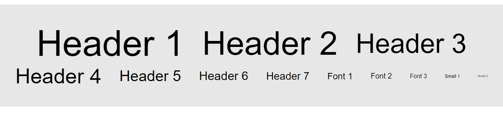
      
   - ***Grosor del texto:*** Estas clases se indican de la siguiente manera:  

     ***f-weight-(valor)***

     El valor puede ir del 1 al 6, siende 1 el menor valor y 6 el mayor.
     En la siguiente imagen podrás observar las diferentes clases para el grosor del texto:

     

   - ***Decoración del texto:*** Estas clases se indican de la siguiente manera:

     ***t-decoration-(valor)***

     Los valores que acepta esta clase son *none*, *underline*, *overline* y *del*. 
     En la siguiente imagen podrás observar las diferentes clases para la decoración del texto:

     

   - ***Alineación del texto:*** Estas clases se indican de la siguiente manera:

     ***t-align-(valor)***

     Los valores que acepta esta clase son *left*, *center*, *right* y *justify*. 
     En la siguiente imagen podrás observar las diferentes clases para la alineación del texto:

     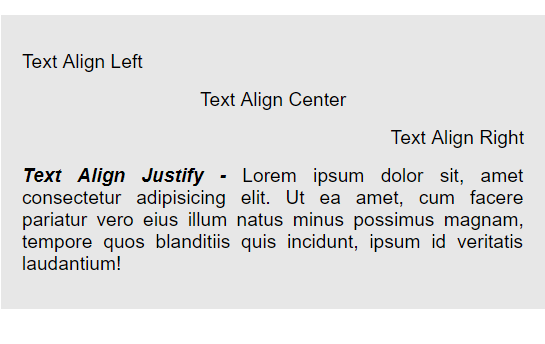
  </details>

  ---

  <details style="padding-left: 20px">
   <summary style="cursor: pointer; display: inline-block; outline: 0;"><strong>Clases para las imagenes:</strong></summary>

   Tyle cuenta con diferentes clases para las imagenes. Estas clases son para el responsive de las imagenes y otras para ponerles filtros.
   Para indicar que una imagen se responsive con Tyle, solo le debes poner la clase ***img-responsive*** a la imagen.
   Las clases para los diferentes filtros se indican de la siguiente manera:

   ***filter-(nombre del filtro)-(valor)***

   Los diferentes valores van del 1 al 10, siendo el 10 el que tiene mayor efecto.
   Acontinuación verás una tabla en la que se muestra los nombres de los diferentes filtros y sus funciones:
      
  </details>

  ---

  <details style="padding-left: 20px;">
   <summary style="cursor: pointer; display: inline-block; outline: 0;"><strong>Clases para la Opacidad:</strong></summary>  
   
   La propiedad *opacity* establece la opacidad o transparencia para un elemento. El valor por defecto es 1 (máximo valor) y el mínimo valor es 0 (transparencia total).

   Con Tyle, para indicar la opacidad de un elemento se hace mediante la siguiente clase: 
 
   ***opacity-(valor)***

   Los diferentes valores van del 0 al 10, donde 0 sería transparente y 10 el valor por defecto.
   
   En la siguiente imagen podrás observar mejor la utilidad de esta propiedad:

   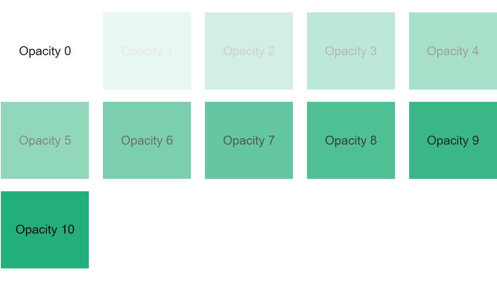
  </details>

  ---

  <details style="padding-left: 20px;">
   <summary style="cursor: pointer; display: inline-block; outline: 0;"><strong>Clases para el Z-index:</strong></summary>  

   La propiedad *z-index* especifica el orden de un elemento en el eje *z*. Con esta propiedad podés elegir que elemento va arriba i cual abajo dependiendo de su valor. Esta propiedad acepta cualquier número, y por defecto es 0.
   Tyle cuenta con 11 valores diferentes para esta propiedad, y se indica de la siguiente manera:

   ***z-index-(valor)***

   El valor va de 0 a 1000, siempre y cuando sea múltiplo de 100, es decir 0, 100, 200, 300, 400, etc..

   En la siguientes imágenes notarás mejor la utilidad de esta propiedad:

   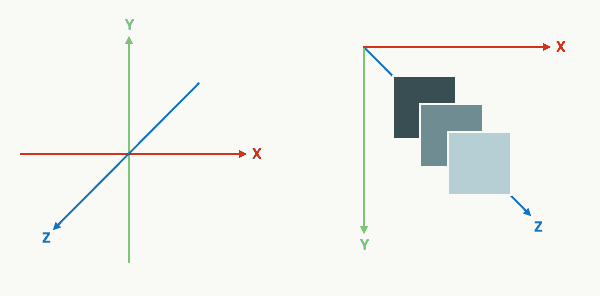
   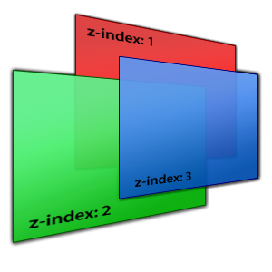   
  </details>

  ---

 ### Componentes:
  
  <details style="padding-left: 20px;"> 
   <summary style="cursor: pointer; display: inline-block; outline: 0;"><strong>Container:</strong></summary>
    
   Las diferentes clases para el ***container***, como su nombre lo indica, se utilizan para contener a los diferentes elementos.
   Tyle cuenta con 4 tipos diferentes de container:

   ***container-full:*** Ocupa el 100%.

   ***container:*** Ocupa el 90%.

   ***container-2:*** Ocupa el 80%.

   ***container-3:*** Ocupa el 70%.   

   Aplicando las diferentes clases para *containers*, y con un poco de estilos para el color de fondo y para la letra, queda de la siguiente manera:
   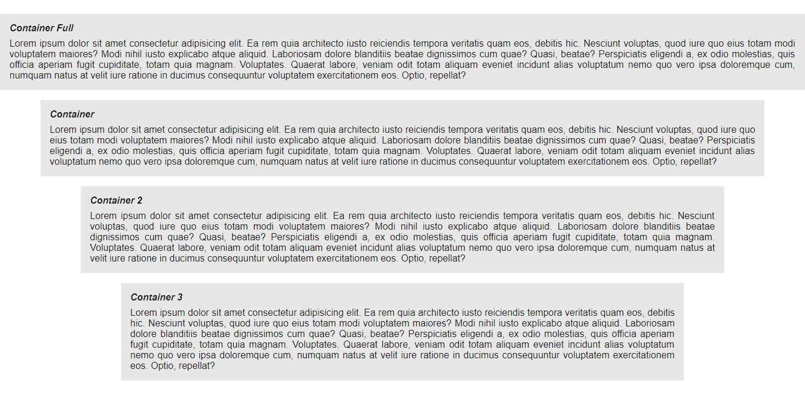

   Además de esto, estas diferentes clases cuentan con el responsive, teniendo la posibiliadad de elegir a partir de cuando querés que se aplique tal *container*. Para esto, las clases se indican de la siguiente manera:
   
   ***container-(medida responsive)-(tipo de container)***
  
   Las medidas responsive son las mencionadas anteriormente en el sistema de grid, y los tipos de container son  los mensionados anteriormente (2, 3, full). En el caso de la clase ***container*** se indica de la siguiente  manera: 

   ***container-(medida responsive)***
  </details>

  ---

  <details style="padding-left: 20px;"> 
   <summary style="cursor: pointer; display: inline-block; outline: 0;"><strong>Botones:</strong></summary>

   Los botones se crean mediante la etiqueta ***&lt;button&gt;*** (de apertura) y ***&lt;/button&gt;*** (de cierre). Debtro de estas etiquetas puedes poner cualquier texto. Hay dieferentes tipos de botones, y el tipo de botón se elige mediante el atributo *type*. Este atributo por defecto es *button*.
   Tyle cuenta con diferentes clases para los botones.

   Para cada botón que quieras hacer con Tyle, tienes que ponerle la clase ***button***, y ya se genera el botón por defecto.

   Además del botón por defecto, hay otro tipo de botón, que es el ***outline***, y a los que se refiere es que el botón solo tendrá color alrededor (un borde), y el color del texto que contenga será igual al de su borde.
   Para indicar este tipo de botón tienes que, además de la clase *button*, agregar la clase ***button-outline***.

   También Tyle cuenta con 3 diferentes tamaños para los botones. Uno es el que viene por defecto, otro más chico,que se indica con la clase ***button-sm***; y otro más grande, que se indica con la clase ***button-lg***.

   En el siguiente ejemplo se mostraran los diferentes tipos de botones mencionados anteriormente:

   HTML
   ```html
    <div class="container">
      <button class="button">Default</button>
      <button class="button button-outline">Default Outline</button>
      <button class="button button-lg">Default Lg</button>
      <button class="button button-lg button-outline">Default Lg Outline</button>
      <button class="button button-sm">Default Sm</button>
      <button class="button button-sm button-outline">Default Sm Outline</button>
    </div>
   ```

   Resultado:
   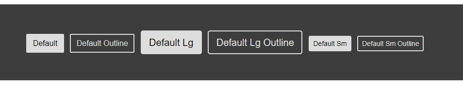

   Como ya se menciono anteriormente, esos eran los botones por defecto. También hay diferentes tipos de colores para los botones, estos colores son los mencionados anteriormente en la *paleta de colores*.
   Para indicar el color de un botón, debes poner, además de la clase *button* (ya que esta es la que genera los estilos básicos del botón), una clase de la siguiente manera:

   ***button-(color)***

   Los diferentes colores son, como ya se mencionó anteriormente, los de la paleta de colores.
   Si quieres, también puedes cambiar el color de un botón *outline* poniendo una clase de la siguiente manera:

   ***button-outline-(color)***

   En la siguiente imagen podrás observar todos los diferentes tipos de botones que puedes hacer:

   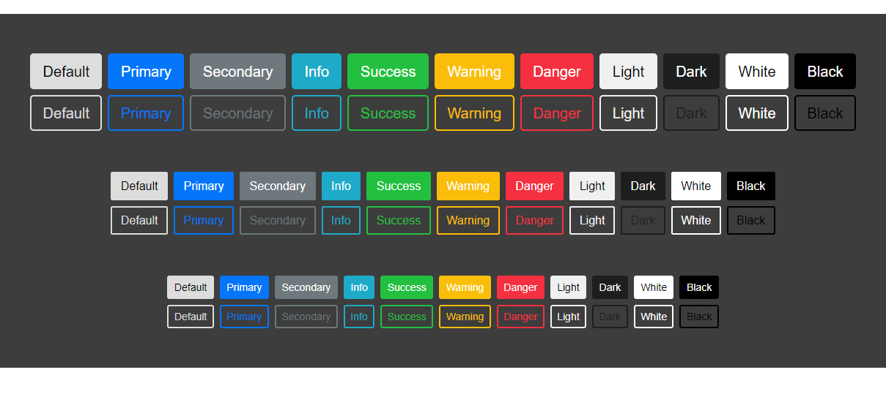
  </details>
  
  ---

  <details style="padding-left: 20px;"> 
   <summary style="cursor: pointer; display: inline-block; outline: 0;"><strong>Scrollbar:</strong></summary>

   El ***scrollbar*** es un componente muy importante a la hora del diseño, pues dejar la que traen los navegadores por defecto podría quedar mal o podría no gustarte o que quieras cambiarla.
   Tyle ofrece clases para modificar el *scrollbar*.
   Para modificar el *scrollbar* con Tyle, tienes que poner la clase ***scrollbar*** al componente que deseas cambiarle el que ya viene por  defecto. Al agregar esta clase a tu componente, se genera el siguiente *scrollbar*, que es el por defecto que trae Tyle:
 
   

   Sin embargo, los colores que trae por defecto la clase *scrollbar* se pueden cambiar. Para cambiar el color de la barra, tienes que indicar una clase (además de la clase *scrollbar*) de la siguiente manera: 

   ***scrollabr-(color)***

   Los diferentes colores son los menconados en la *paleta de colores*.

   En la siguiente imagen podrá ver ejemplos de algunos de los diferentes colores del *scrollbar:*
  
   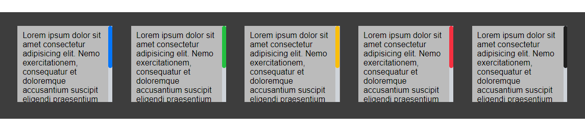

   Además de poder cambiar el color de la barra, puedes cambiar el fondo del *scrollbar* indicando una clase de la siguiente manera:
 
   ***scrollabr-bg-(color)**

   A continuación podrá ver en la imagen ejemplos del color de fondo:

   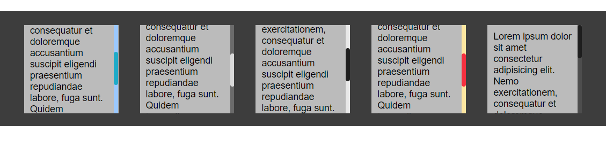

   Además de todo lo mencionado, Tyle cuenta con clases como para dar otro "efecto" al *scrollbar*. Este "efecto" se indica con la clase ***scrollbar-3d***, y le puedes aplicar esta clase a cualquiera que tenga la clase *scrollbar*, aunque también tenga clases de diferentes colores de la barra y de fondo.
   En la siguiente imagen verás ejemplos de esta clase:

   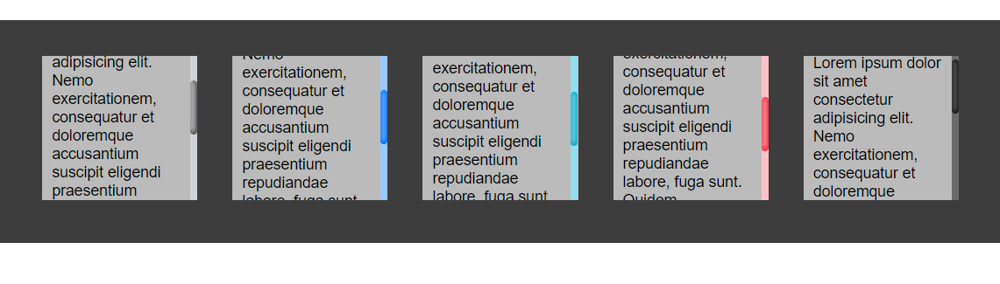

   Ahora, verán un ejemplo de el *scrollbar* hecho en html:

   HTML
   ```html
      <div class="container">

        <div class="box scrollbar">Lorem ipsum dolor sit amet consectetur adipisicing elit. Nemo exercitationem, consequatur et doloremque accusantium suscipit eligendi praesentium repudiandae labore, fuga sunt. Quidem temporibus deleniti, repudiandae omnis nobis eligendi mollitia dolorum.</div>

        <div class="box scrollbar scrollbar-3d scrollbar-primary scrollbar-bg-info">Lorem ipsum dolor sit amet consectetur adipisicing elit. Nemo exercitationem, consequatur et doloremque accusantium suscipit eligendi praesentium repudiandae labore, fuga sunt. Quidem temporibus deleniti, repudiandae omnis nobis eligendi mollitia dolorum.</div>

        <div class="box scrollbar scrollbar-danger">Lorem ipsum dolor sit amet consectetur adipisicing elit. Nemo exercitationem, consequatur et doloremque accusantium suscipit eligendi praesentium repudiandae labore, fuga sunt. Quidem temporibus deleniti, repudiandae omnis nobis eligendi mollitia dolorum.</div>

        <div class="box scrollbar scrollbar-light scrollbar-bg-dark">Lorem ipsum dolor sit amet consectetur adipisicing elit. Nemo exercitationem, consequatur et doloremque accusantium suscipit eligendi praesentium repudiandae labore, fuga sunt. Quidem temporibus deleniti, repudiandae omnis nobis eligendi mollitia dolorum.</div>  

        <div class="box scrollbar scrollbar-3d scrollbar-dark scrollbar-bg-dark">Lorem ipsum dolor sit amet consectetur adipisicing elit. Nemo exercitationem, consequatur et doloremque accusantium suscipit eligendi praesentium repudiandae labore, fuga sunt. Quidem temporibus deleniti, repudiandae omnis nobis eligendi mollitia dolorum.</div>

        <!-- La clase box (no es de Tyle) indica un alto, un ancho y un color de fondo -->
    </div>
   ```

   Resultado:
 
   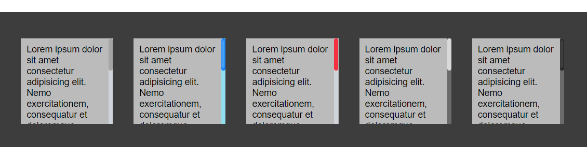
  </details>

  ---

  <details style="padding-left: 20px;"> 
   <summary style="cursor: pointer; display: inline-block; outline: 0;"><strong>Poster:</strong></summary>

   El componenete ***poster*** sirve para cubrir el fondo de un *div*, pero al tener una opacidad, si hay una imagen de fondo, esta se verá debajo del poster, pero se verá. Es importante destacar que todos los hijos que esten dentro del elemento con la clase *poster*, se verán encima del *poster*, es decir que no se verán afectados. El *poster* puede ser de cualquier color de la *paleta de colores*.
   Para inidicar que un elemento tenga un *poster*, se le debe poner la clase *poster* y  la clase ***poster-(color)***. Sin esta última clase no tendrá efecto el *poster*, ya que por defecto es transparente. 

   En el siguiente ejemplo notarás lo mencionado anteriormente:

   HTML
   ```html
    <div class="container">
      <div class="box poster poster-primary"> <!--  La clase box (no es de Tyle) da un alto, un ancho, un centrado a sus elementos hijos, y da una imagen de fondo -->
          <p>Poster Primary</p>
      </div>
    </div>
   ```
   Reesultado:
   

   A continuación, en el siguiente ejemplo, podrán ver mejor que los componentes hijos del *poster* van por encima de él. En este ejemplo se utilizarán algunas clases utilitarias de Tyle, y un componenete de Tyle:

   HTML
   ``` html
   <div class="container">
      <div class="box poster poster-info">
          <h1>Poster Title</h1>
          <h2 class="mb-2">Poster Subtitle</h2>
          <p>Lorem ipsum dolor sit amet consectetur adipisicing elit. Atque tempora repellat fuga? Quae atque ipsa dignissimos? In doloribus vitae eligendi?Lorem ipsum dolor sit amet consectetur adipisicing elit. Assumenda ipsum earum dolores, neque mollitia doloribus amet? Autem numquam dolore itaque labore ipsam alias magnam eum, veritatis ratione? Ut, nulla aliquid.</p>
          <div class="d-flex mt-3">
              <button type="button" class="button button-success">Poster Button</button>
              <button type="button" class="button button-success ml-2">Poster Button 2</button>                
          </div>
      </div>
   </div>
   ```

   Resultado:
   

   Para modificar la opacidad del *poster*, solo tienes que agregarle la clase *poster-(valor)*. El valor va del 0 al 10, siendo 0 el menor valor y 10 el mayor.
   En la siguiente imagen podrás notar lo mencionado:

   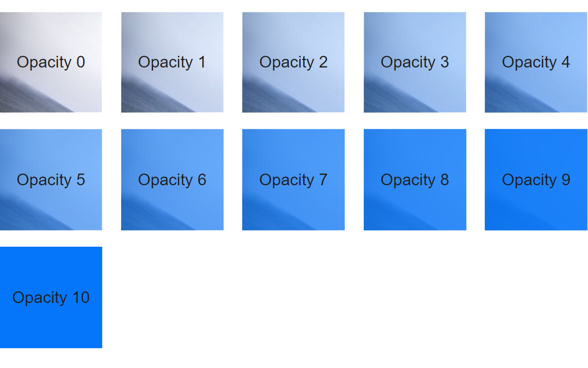
  </details>

  ---

  <details style="padding-left: 20px;"> 
   <summary style="cursor: pointer; display: inline-block; outline: 0;"><strong>Progress-bar:</strong></summary>

   Las barras de progreso (***progress bar***) sirven para indicar la cantidad de progreso que se ha realizado hasta el momento dado.

   Tyle ya tiene clases para realizar una barra de progreso facilmente.
   Las *progress-bar* con Tyle se crean mediante un *div* con la clase ***progress-bar***, y dentro de este *div*, creas otro *div* con la clase ***progress-bar-percent***. Este último *div* es el que genera el porcentaje de la *progress-bar*, y para indicarle la cantidad del progreso, se hace mediante la propiedad *width*. Por ejemplo, si al *div* con la clase *progress-bar-percent* le agregás un ancho de 76%, la barra de progreso indicará que va por el 76%. El texto que va d¡en la barra de progreso, lo tienes que poner dentro del div con la clase *progress-bar-percent*.
   En el siguiente ejemplo notarás mejor lo mencionado anteriormente:

   HTML
   ```html
    <div class="progress-bar">
        <div class="progress-bar-percent">76%</div> <!-- Se le indicó mediante css un width de 76% -->
    </div>
   ```  

   Resultado:
   

   Para cambiar el color de esta barra que indica el porcentaje, se le tiene que agregar (al *div* con la clase *progress-bar-percent*) la siguiente clase (ya mencionada anteriormente en la paleta de colores):

   *bg-(color)*

   Los colores son los de la *paleta de colores*.
   Ejemplo:

   HTML
   ```html
    <div class="progress-bar">
        <div class="progress-bar-percent bg-danger">76%</div> <!-- Se le indicó mediante css un width de 76% -->
    </div>

    <div class="progress-bar">
        <div class="progress-bar-percent bg-primary">38%</div> <!-- Se le indicó mediante css un width de 38% -->
    </div>

    <div class="progress-bar">
        <div class="progress-bar-percent bg-dark">50%</div> <!-- Se le indicó mediante css un width de 50% -->
    </div>
   ```  

   Resultado:
   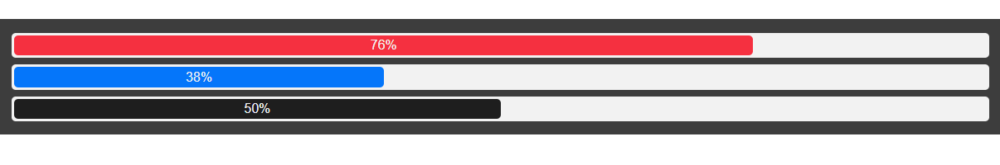

   Además de poder cambiar el color de fondo de la barra del porcentaje, tienes la opción de cambiar el color de fondo del *progress-bar*, de la misma manera; poniendo la clase *bg-(color)* al *div* con la clase *progress-bar*.
   
   HTML
   ```html
   <div class="progress-bar bg-light">
      <div class="progress-bar-percent bg-danger">76%</div> <!-- Se le indicó mediante css un width de 76% -->
   </div>

   <div class="progress-bar bg-info">
      <div class="progress-bar-percent bg-primary">38%</div> <!-- Se le indicó mediante css un width de 38% -->
   </div>

   <div class="progress-bar bg-dark">
      <div class="progress-bar-percent bg-light color-dark">50%</div> <!-- Se le indicó mediante css un width de 50% -->
   </div>
   ```  

   Resultado:
   

   Además de poder cambiar los colores, con Tyle, se puede cambiar los tamaños de la *progress-bar*. Hay 3 tipos diferentes de tamaño para la *progress-bar*, y uno de ellos es el que viene por defecto. Para cambiar el tamaño, se le debe indicar al *div* con la clase *progress-bar* la clase ***progress-bar-sm*** (menor tamaño) o la clase ***progress-bar-lg*** (mayor tamaño).
   Ejemplo: 

   HTML
   ```html
   <div class="progress-bar progress-bar-lg">
       <div class="progress-bar-percent bg-success">76%</div> 
   </div>
 
   <div class="progress-bar">
       <div class="progress-bar-percent bg-info">38%</div>
   </div>
   
   <div class="progress-bar progress-bar-sm bg-dark">
       <div class="progress-bar-percent bg-warning color-dark">50%</div>
   </div>
   ```  

   Resultado:
   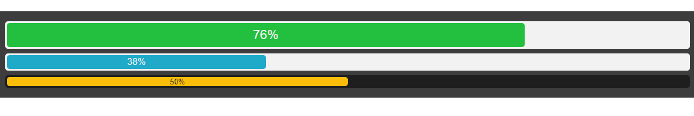

   Por último para las *progress-bar*, esta la opción de poner más de una barra de porcentaje en una *progress-bar* de una manera mu facil.   Solo tenés que poner dentro del *div* con la clase *progress-bar* otra barra de porcentaje. Si las dos o más barras de porcentaje superan el 100% de la *progress-bar*, estas barras se achicaran para no ocupar más del 100%.
   En el siguiente ejemplo notarás mejor lo mencionado anteriormente:

   HTML
   ```html
   <div class="progress-bar">
      <div class="progress-bar-percent bg-success">26%</div> 
      <div class="progress-bar-percent bg-danger">56%</div> 
      <div class="progress-bar-percent bg-primary">15%</div>             
   </div>

   <div class="progress-bar"> <!-- Las barras de porcentaje superan el 100% -->
      <div class="progress-bar-percent bg-info">48%</div> 
      <div class="progress-bar-percent bg-warning">12%</div>
      <div class="progress-bar-percent bg-secondary">50%</div>            
   </div>
   ```  

   Resultado:
   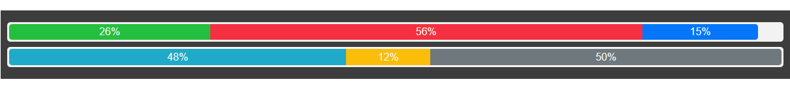
  </details>

  ---

  <details style="padding-left: 20px;"> 
   <summary style="cursor: pointer; display: inline-block; outline: 0;"><strong>Progress-circle:</strong></summary>

   Una alternativa a las *progress-bar* son los *progress-circle* cuya función es la misma (indicar el progreso que se ha realizado).

   Hacer un *progress-circle* con Tyle es muy sencillo. Para hacerlo tienes que crear un *div* con la clase ***progress-circle***, este será el div que contenga los diferentes elementos que se utilizan para crear el *progress-circle*. Dentro de este *div* van 3 elementos:

   ***progress-circle-percent:*** Este es el que indica el porcentaje de forma gráfica. Para indicar el porcentaje tienes que agregar a este elemento el atributo ***data-value***. El valor que le pongas a este atributo será el porcentaje. Este elemento va con la etiqueta ***&lt;div&gt;*** .

   ***progress-circle-percent-text:*** Este es el que indica el porcentaje con números. Dentro de este tu mismo le indicas el porcentaje (no cambia nada del gráfico solor son números). Va con la etiqueta ***&lt;p&gt;*** .

   ***progress-circle-text:*** Este indica el tema del gráfico. Va con la etiqueta ***&lt;p&gt;*** .

   En el siguiente ejemplo notarás mejor lo mencionado anteriormente

   HTML
   ```html
   <div class="progress-circle">
     <div class="progress-circle-percent" data-value="78"></div>
     <p class="progress-circle-text">ProgressCircle</p>
     <p class="progress-circle-percent-text">78</p>
   </div>
   ```
    
   Resultado:
   

   El *progress-circle*, de la anterior imagen, es el quen trae por defecto Tyle. Como podrás haber adivinado, podés cambiar el color de los *progress-circle*. Para hacerlo, tienes que agregar al *div* con la clase *progress-circle* la siguiente clase:

   ***progress-bg-(color)***

   Los diferentes colores son los mencionados en la paleta de colores.

   A continuación verás un ejemplo de lo mencionado:
   HTML
   ```html
    <div class="progress-circle progress-bg-danger">
      <div class="progress-circle-percent" data-value="63"></div>
      <p class="progress-circle-text">Danger</p>
      <p class="progress-circle-percent-text">63</p>
    </div>
   ```

   Resultado:
   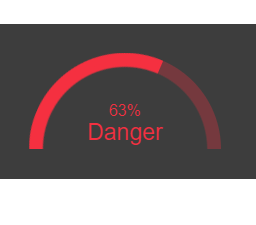

   Como podrás haber notado, también se cambia el color del texto, pero si deseas cambiarlo puedes hacerlo agregando las clases (ya mencionadas anteiormente en la *paleta de colores*) *color-(color)*.

   A continuación verás una imagen con los diferentes tipos de colores para los *progress-circle:*
   

   Por último, para los *progress-circle* hay 5 tipos de tamaños diferentes: *xl*(más grande) *lg* (2do más grande), el que viene por defecto,*sm* (2do más chcio) y *xs* (más chico).
   Para indicar el tamaño tienes que agregar al *div* con la clase *progress-circle* la siguiente clase:

   ***progress-circle-(medida)***

   En el siguietne ejemplo podrás notar los 5 tipos diferentes de tamaños:
  
   HTML
   ```html
    <div class="container">
      <div class="progress-circle progress-bg-success progress-circle-xl">
          <div class="progress-circle-percent" data-value="97"></div>
          <p class="progress-circle-text color-info">XL</p>
          <p class="progress-circle-percent-text color-info">97</p>
      </div>

      <div class="progress-circle progress-bg-danger progress-circle-lg">
          <div class="progress-circle-percent" data-value="83"></div>
          <p class="progress-circle-text color-info">LG</p>
          <p class="progress-circle-percent-text color-info">83</p>
      </div>

      <div class="progress-circle progress-bg-dark">
          <div class="progress-circle-percent" data-value="57"></div>
          <p class="progress-circle-text color-light">DEFAULT</p>
          <p class="progress-circle-percent-text color-light">57</p>
      </div>

      <div class="progress-circle progress-bg-primary progress-circle-sm">
          <div class="progress-circle-percent" data-value="45"></div>
          <p class="progress-circle-text color-success">SM</p>
          <p class="progress-circle-percent-text color-success">45</p>
      </div>

      <div class="progress-circle progress-bg-info progress-circle-xs">
          <div class="progress-circle-percent" data-value="32"></div>
          <p class="progress-circle-text color-light">XS</p>
          <p class="progress-circle-percent-text color-light">32</p>
      </div>
    </div>
   ```

   Resultado:
   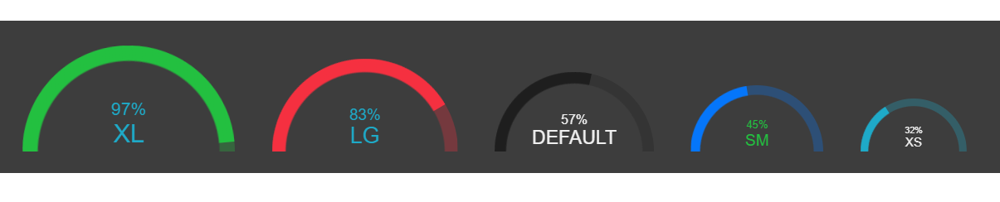
  </details>

  ---
 
  <details style="padding-left: 20px;"> 
   <summary style="cursor: pointer; display: inline-block; outline: 0;"><strong>Cards:</strong></summary>

   El componente *card* es una forma de mostrar contenido de diferentes tipos de objetos. También son muy adecuadas para presentar objetos similares cuyo tamaño o acciones soportadas pueden variar considerablemente, como fotos con subtítulos de longitud variable.

   Para crear una *card* con Tyle tienes que crear un *div* con la clase ***card***. Por si solo, este div con la clase *card* no generará nada mas que el borde, es decir que necesita que halla contenido dentro de esta *card*. Para comenzar a poner contenido dentra del componente *card*, tienes que agregar la clase ***card-container***, y dentro de este *div* puedes poner lo que desees. Para este componente, puedes poner un título, que debe llevar la clase ***card-title***, y a suvez, para crear un subtítulo, debes agregarle la clase ***card-subtitle***. Para agregar texto, tienes que ponerle al texto la clase ***card-text***.

   En el siguiente ejemplo podrás observar lo mencionado anteriomente:
   HTML 
   ```html
    <div class="card">
        <div class="card-container">
            <h2 class="card-title">
                Card Title
            </h2>

            <h3 class="card-subtitle">
                Card Subtitle
            </h3>

            <p class="card-text">
                Lorem ipsum dolor sit amet consectetur adipisicing elit. Reprehenderit ea dolore hic porro obcaecati odit quidem fugiat optio ad expedita accusantium cupiditate non delectus aperiam ex, sint rerum pariatur ab.
            </p>
        </div>
    </div>
   ```

   Resultado:
   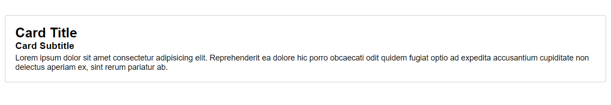

   Como pordrás haber observado, el component *card* ocupa un 100% de su espacio disponible, pero eso se puede solucionar facilmente poniendole in ancho, y esto se podría hacer, por ejemplo, con el *sistema de grid* de Tyle:

   HTML
   ```html
    <div class="row">
        <div class="col-3">
            <div class="card">
                <div class="card-container">
                    <h2 class="card-title">
                        Card Title
                    </h2>

                    <h3 class="card-subtitle">
                        Card Subtitle
                    </h3>

                    <p class="card-text">
                        Lorem ipsum dolor sit amet consectetur adipisicing elit. Reprehenderit ea dolore hic porro obcaecati odit quidem fugiat optio ad expedita accusantium cupiditate non delectus aperiam ex, sint rerum pariatur ab.
                    </p>
                </div>
            </div>
        </div>
    </div>
   ```

   Resultado:
   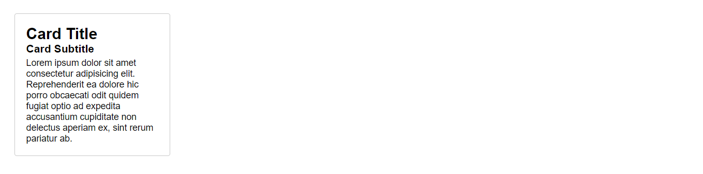

   Este componente, tambíen puede contener elementos con un header o un footer de la *card*. El header dentro de la *card* se indica con la clase ***card-header***, y el footer con la clase ***card-footer***. Estos elementos, se deben colorcar fuera del *div* con la clase *card-container*.

   En el siguiente ejemplo podrás notar mejor lo mencionado anteriormente:

   HTML
   ```html
    <div class="row">
        <div class="col-3">
            <div class="card">
                <div class="card-header">
                    Card Header
                </div>
                <div class="card-container">
                    <h2 class="card-title">
                        Card Title
                    </h2>

                    <h3 class="card-subtitle">
                        Card Subtitle
                    </h3>

                    <p class="card-text">
                        Lorem ipsum dolor sit amet consectetur adipisicing elit. Reprehenderit ea dolore hic porro obcaecati odit quidem fugiat optio ad expedita accusantium cupiditate non delectus aperiam ex, sint rerum pariatur ab.
                    </p>
                </div>
                <div class="card-footer">
                    Card Footer
                </div>
            </div>
        </div>
    </div>
   ```

   Resultado:
   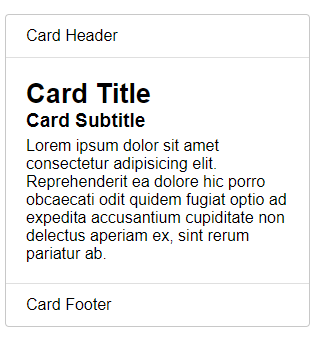

   Para agregar imagenes a la parte de arriba de la *card*, tienes que crear un *div* (fuera del *card-container*) con la clase *card-top*, y aqui dentro de este *div* puedes agregar tu imagen de cabecera. A esta imagen que pongas dentro del ***card-top***, tienes que ponerle la clase ***card-img***. Pero dentro de esto *div*, puedes poner mas que solo imagenes, puedes poner tambien por ejemplo el título o el subtítulo de la *card*.

   En el siguiente ejemplo podrás observar lo mencionado anteriormente:

   HTML
   ```html
    <div class="row">
        <div class="col-4">
            <div class="card">
                <div class="card-top">
                    
                    <h2 class="card-title"> Card Title </h2>
                </div>

                <div class="card-container">
                    <p class="card-text t-align-justify">
                        Lorem ipsum dolor sit amet consectetur adipisicing elit. Reprehenderit ea dolore hic porro obcaecati odit quidem fugiat optio ad expedita accusantium cupiditate non delectus aperiam ex, sint rerum pariatur ab.
                    </p>
                </div>

                <div class="card-footer">
                    <button class="button button-danger button-sm">Card Footer</button>
                    <button class="button button-danger button-sm">Card Footer</button>                                
                </div>
            </div>                
        </div>
    </div>
   ```

   Resultado:
   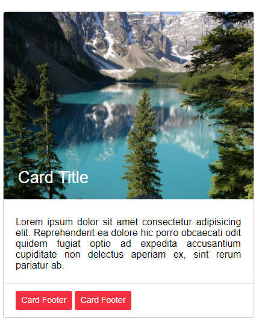  

   Además de lo mencionado anteriormente, como podrás saber, puedes cambiarle el color de fondo de las *cards* con las diferentes clases de *bg-(color)* aplicandoselas al *div* con la clase *card*

   Ejemplo:

   HTML
   ```html
    <div class="row">
        <div class="col-4">
            <div class="card bg-danger">
                <div class="card-header">
                    <h2 class="card-title color-white">Card Title Header</h2>
                </div>

                <div class="card-container">
                    <p class="card-text t-align-justify color-white">
                        Lorem ipsum dolor sit amet consectetur adipisicing elit. Reprehenderit ea dolore hic porro obcaecati odit quidem fugiat optio ad expedita accusantium cupiditate non delectus aperiam ex, sint rerum pariatur ab.
                    </p>
                </div>

                <div class="card-footer">
                    <p class="card-text color-white">Card Footer</p>                             
                </div>

            </div>
        </div>
    </div>
   ```

   Resultado:
   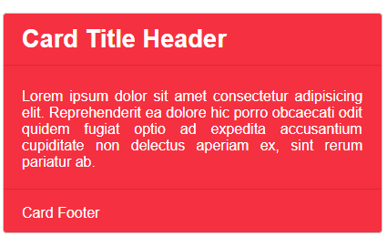 
  </details>
  
  ---
  
  <details style="padding-left: 20px;"> 
   <summary style="cursor: pointer; display: inline-block; outline: 0;"><strong>Modals:</strong></summary>

   Un *modal* es un cuadro de diálogo o una ventana emergente que permanece oculta hasta que haces click en el elemnto que muestra el *modal*.

   Con Tyle tienes la posibilidad de realizar ventanas modales de una manera mut sencilla.
   Para comenzar a crear tu *modal*, primero tienes que crear el componente en el cual, cuando hagas click, se habra el modal. Este componente, puede ser por ejemplo un botón, tiene que tener el atributo ***data-open-modal="valor"*** , este valor que va en el atributo *data-open-modal* puede ser cualquiera, el que se te ocurra.

   Una vez que tengas este componente, tienes que empezar con la ventana, modal. Para esto, creas un *div* con la clase ***modal***, este *div* tiene que tener el atributo ***id*** , y el valor del *id* tiene que ser el mismo valor que el del *data-open-modal* que tenía el otro componente. Una vez hecho esto, el *modal* ya funcionara, solo faltará agregarle contenido.

   Para agregarle contenido al *modal*, dentro del *div* con la clase *modal*, tienes que crear otro *div* con la clase ***modal-container***,y dentro de este *div* pones todo el contenido de tu modal.
   
   Un componente que debe ir si o si dentro del *modal* es aquel en el que cuando apretás en él se cierra el *modal*. Este componente puede ser por ejemplo una cruz, y dicho componente, tiene que tener el atributo ***data-close-modal="valor"*** . Este valor tiene que ser el mismo valor del *id* que tiene el *modal*. Si quieres que este componente sea una cruz, debes agregarle la clase ***modal-cross***, y dentro de esta agregas lo siguiente: &times; . Esto último es un código que generará la cruz.

   Para agregar contenido a tu modal, dentro del *modal-container*, puedes agregar 3 *divs* con clases diferentes, estas diferentes calses son: ***modal-header*** , ***modal-body*** y ***modal-footer***, y es conveniente ponerlos en ese orden en tu *html* así queda bien.

   En el siguiente ejemplo podrás notar mejor lo mencionado anteriormente:

   HTML
   ```html
    <button class="button button-danger" data-open-modal="example">Open Modal</button>
    <div class="modal" id="example">
        <div class="modal-container ">
            <div class="modal-cross" data-close-modal="example">&times;</div>
            <div class="modal-header">
                <h2>Modal Header</h2>
            </div>

            <div class="modal-body">
                <h2 class="mb-3">Modal Body</h2>
                <p>Lorem ipsum dolor sit amet consectetur adipisicing elit. Blanditiis provident officia enim porro neque aliquam mollitia
                   laborum suscipit odio, dolores nesciunt itaque pariatur beatae minima officiis consectetur hic molestias essitatibus!
                   Lorem ipsum dolor sit amet consectetur adipisicing elit. Quia molestiae perferendis blanditiis rem facere nobis ratione 
                   soluta, aspernatur consequuntur enim consectetur, explicabo, ipsam provident numquam totam nam illum qui ut!</p>
            </div>

            <div class="modal-footer">
                <h2>Modal Footer</h2>
            </div>
        </div>
    </div>
   ```

   Resultado:
   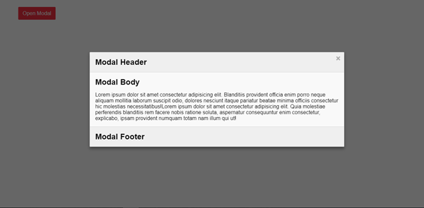   
   

   El *modal* que se acabó de mostrar en las anteriores imagenes es el que se genera por defecto, es decir, que lo puedes personalizar como quieras. Con Tyle puedes cambiar el color de fondo, el tamaño, la posición en la que se encuntra en la pantalla y la animación que hace cuando se abre. Pero además de esto, puedes escribir tu propio código css para modificarlo a tu gusto.

   Para modificar el color de fondo al *div* del *modal-container*, solo tienes que agregarle la clase *bg-(color)* (ya mencionada anteriormente).
   En la siguiente imagen podrás notar esto:

   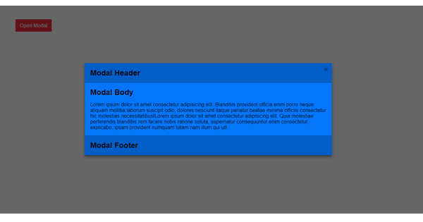   
      
   Existen 5 tamaños diferentes para los *modals*: *xs* (el más chico), *sm* (el segundo más chcio), el que viene por defecto, *md* (el segundo más grande) y *lg* (el más grande). Para modificar el tamaño del *modal-container*, tienes que agregarle la clase *modal-(valor)* ,los diferentes valores son los mencionados anteriormente.  
   En las siguiente imagens podrás ver los diferentes tamaños:  

   - *xs*
   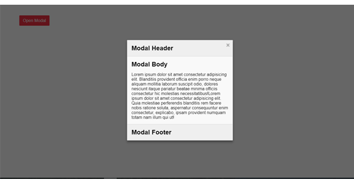   
   - *sm*   
   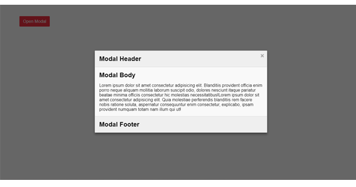   
   - *default value*   
   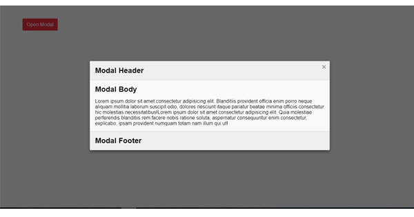   
   - *md*   
   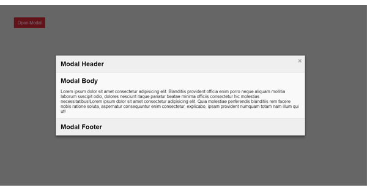  
   - *lg*    
   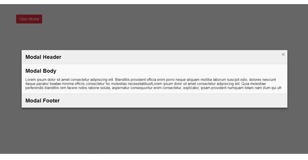   

   Como ya se mencionó, puedes posicionar el *modal* en diferentes lugares. Puedes posicionarlo en 3 lugares diferentes: arriba, en el medio(ya esta por defecto) y abajo. Para pocicionar el *modal* arriba, tienes que agregarle al *div* con la clase *modal* la clase *modal-start*, y para pocicionarlo abajo, tienes que agregarle la clase *modal-end*.
   En las siguientes imagenes podrás notar su posicionamiento:

   - *start*
    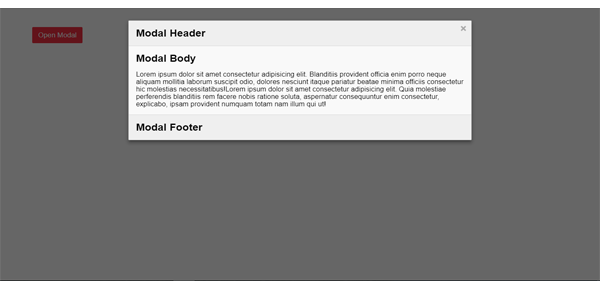   
   - *end*   
    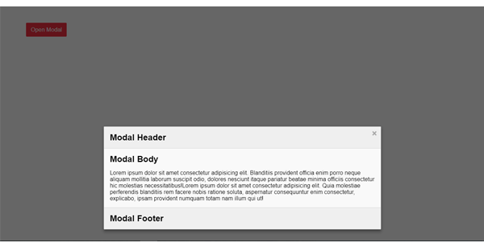  


   Como ya se mencionó, puedes ponerles diferentes animaciones a los *modals*. Tyle cuenta con 6 tipos diferenes de animaciones para estos, y para usarlas, tienes que agregarle al *div* con la clase *modal* la clase ***animation-(valor)***. Los valores se mencionarán a continuación y los podrán observar mediante imagenes *gif:*

   - ***fade:*** Esta es la animación que viene por defecto, lo que hace es pasar de un estado transparente (*opacity: 0*) a uno solido (opacity: 1).

   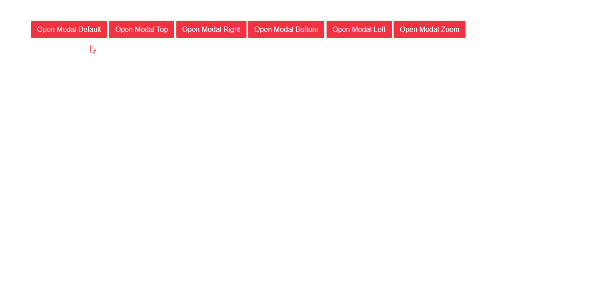  


   - ***top:*** El *modal* viene por arriba y, al cerrarse se va por arriba. Se indica con la clase ***animation-top*** .  

   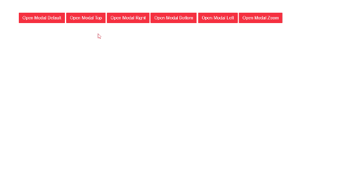 


   - ***right:*** El *modal* viene por la derecha y, al cerrarse se va por la derecha. Se indica con la clase ***animation-right*** .  

   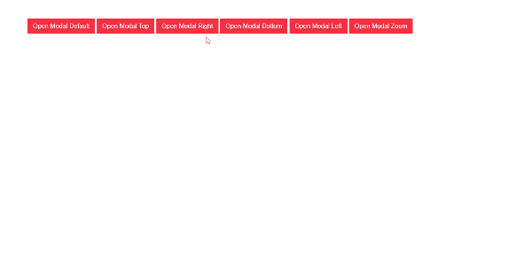 


   - ***bottom:*** El *modal* viene por debajo y, al cerrarse se va por debajo. Se indica con la clase ***animation-bottom*** . 

   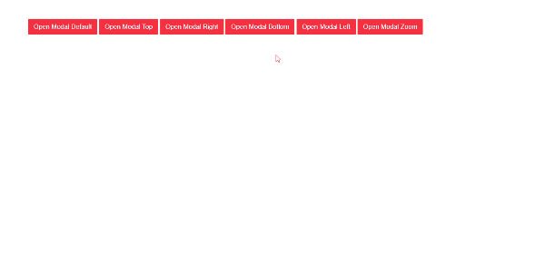 


   - ***left:*** El *modal* viene por la izquierda y, al cerrarse se va por la izquierda. Se indica con la clase ***animation-left*** .     

   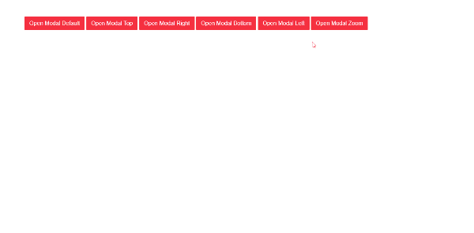


   - ***zoom:*** El *modal* viene acercandose (aumentando su tamaño) y, al cerrarse se va alejandose (disminuyendo su tamaño). Se indica con la clase ***animation-zoom*** .     

   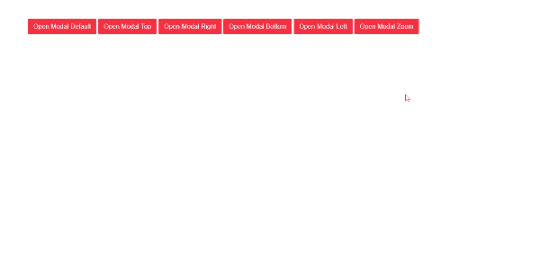


   Por último para los *modals*, puedes elegir la animación que quieras cuando se cierra el modal, agregando la clase *to-(valor)* , los valores son los mencionados anteriormente (fade, top, right, etc..)
   En el siguitente ejemplo podrás observar lo mencionado anteriormente:

   HTML
   ```html
    <button class="button button-danger" data-open-modal="example-2">Open Modal</button>
    <div class="modal animation-left to-right" id="example-2">
        <div class="modal-container ">
            <div class="modal-cross" data-close-modal="example-2">&times;</div>
            <div class="modal-header">
                <h2>Modal Header</h2>
            </div>

            <div class="modal-body">
                <h2 class="mb-3">Modal Body</h2>
                <p>Lorem ipsum dolor sit amet consectetur adipisicing elit. Blanditiis provident officia enim porro neque aliquam mollitia
                   laborum suscipit odio, dolores nesciunt itaque pariatur beatae minima officiis consectetur hic molestias essitatibus!
                   Lorem ipsum dolor sit amet consectetur adipisicing elit. Quia molestiae perferendis blanditiis rem facere nobis ratione 
                   soluta, aspernatur consequuntur enim consectetur, explicabo, ipsam provident numquam totam nam illum qui ut!</p>
            </div>

            <div class="modal-footer">
                <h2>Modal Footer</h2>
            </div>
        </div>
    </div>
   ```

   Resultado:
   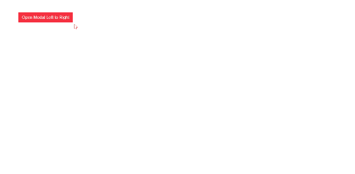   
  </details>
   
  ---
  
  <details style="padding-left: 20px;"> 
   <summary style="cursor: pointer; display: inline-block; outline: 0;"><strong>Navs:</strong></summary>

   Las *navbars*, o barras de navegación, son un elemento muy importante en las páginas web, ya que, como su nombre lo indica, te permiten navegar por la página o sitio web.

   Con Tyle, se pueden crear *navbars* de una manera sencilla.

   Para comenzar a crear tu *nav*, tienes que crear la etiqueta ***&lt;nav&gt;*** . A esta etiqueta *nav*, tienes que ponerle la clase ***nav***, y una vez hecho esto puedes comenzar a poner el contenido de la *nav*. 
   Los componentes que tienen que estar en una *navbar* son el logo y los diferentes links para permitir la navegación.

   Para crear el logo en la *nav*, tienes que crear (dentro de la etiqueta *nav*) un *div* con la clase ***nav-logo-container***, y dentro de este *div* puedes poner el logo. El logo puede ser texto o una imagen, pero tiene que tener la clase ***nav-logo*** .

   Una vez que ya tienes el logo, puedes seguir con los diferentes links. Para comenzar a poner los links, dentro de la etiqueta *nav* tienes que crear un *div* con la clase ***nav-list-container*** . Dentro de este *div* creas un *ul* con la clase ***nav-list***, y dentro de este *ul* ponés sus respectivos *li*, estos *li* tienen que tener la clase ***nav-item***, y dentro de ellos ponés los enlaces (con la etiqueta *a*). Estos enlaces tienen que tener la clase ***nav-link*** .

   En el siguiente ejemplo podrás notar lo mencionado anteriormente:

   HTML
   ```html
    <nav class="nav">
        <div class="nav-logo-container">
            <h1 class="nav-logo">Logo</h1>
        </div>

        <div class="nav-list-container">
            <ul class="nav-list">
                <li class="nav-item"><a href="#" class="nav-link">Inicio</a></li>
                <li class="nav-item"><a href="#" class="nav-link">Nosotros</a></li>
                <li class="nav-item"><a href="#" class="nav-link">Productos</a></li>
                <li class="nav-item"><a href="#" class="nav-link">Contacto</a></li>             
            </ul>
        </div> 
    </nav> 
   ```

   Resultado:
   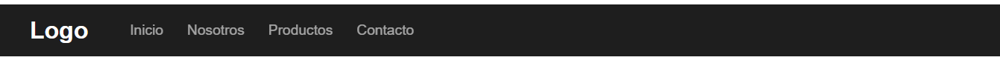

   Como podrás observar, no hay nada que se desmaquete, pero al achicar la ventana, al no haber espacio, se desmaqueta y no entran los textos.
   Para este problema del responsive Tyle tiene una solución. Para hacer el *nav* responsive, a la etiqueta *nav* con la clase *nav* tienes que agregarle la clase ***nav-responsive-(medida)*** . Las diferentes medidas que se aceptan son *sm*, *md* y *lg*. El valor de estas medidas son las mencionadas anteriormente anteriormente. 
   
   Pero con agregar esta clase sola no basta, también hace falta agregar el ícono de las 3 barras, indicando que al apretar en él se desplegará el menú.

   Para esto, dentro de la etiqueta *nav*, crearás un *div* con la clase ***nav-bars-container***, y dentro de este *div*, crearás otro más con la clase ***nav-bars***, y dentro de este *div* pones el ícono de las 3 barras, o bien, para hacerlo con Tyle, en vez del ícono pones 3 *span* con la clase ***nav-bars-span*** . 
   
   Ya una vez hecho esto, tendrás el ícono, pero al apretar en él no pasa nada, no se abre el *nav*. Para lograr que funcione, tienes que agregarle el atributo ***id="valor"*** al *div* con la clase *nav-list-container*, el valor del *id* puede ser cualquiera, el que se te ocurra.
   
   Además de esto, tienes que ponerle al *div* con la clase *nav-bars* (también debes ponerselos a los *span* que están dentro de este *div* para evitar errores) el atributo ***data-open-nav="valor"*** , dicho valor tiene que ser el mismo que el valor del *id* del *div* con la clase *nav-list-container*. 

   Con esto, ya lograrás que funcione, pero falta una pequeña cosa: que se cierre. Para lograr que se cierre, dentro del *div* con la clase *nav-list-container* tienes que crear un *div* con la clase ***nav-close*** , y dentro de él ponés una cruz con el código ***&amp;times;*** . Con esto ya tendrás la cruz, pero para lograr que se cierre el *nav*, tienes que agregarle al *nav-close* el atributo ***data-close-nav="valor"*** , y como podrás haber adivinado, el valor tiene que ser el mismo que el valor del *id*.

   En el siguiente ejemplo podrás notar mejor lo mencionado anteriormente:

   HTML
   ```html
    <nav class="nav nav-responsive-md">
        <div class="nav-logo-container">
            <h1 class="nav-logo">Logo</h1>
        </div>

        <div class="nav-bars-container">
            <div class="nav-bars" data-open-nav="nav">
                <span class="nav-bars-span" data-open-nav="nav"></span>
                <span class="nav-bars-span" data-open-nav="nav"></span>
                <span class="nav-bars-span" data-open-nav="nav"></span>
            </div>
        </div> 

        <div class="nav-list-container" id="nav">
            <div class="nav-close" data-close-nav="nav">&times;</div>
            <ul class="nav-list">
                <li class="nav-item"><a href="#" class="nav-link">Inicio</a></li>
                <li class="nav-item"><a href="#" class="nav-link">Nosotros</a></li>
                <li class="nav-item"><a href="#" class="nav-link">Productos</a></li>
                <li class="nav-item"><a href="#" class="nav-link">Contacto</a></li>               
            </ul>
        </div> 
    </nav> 
   ```

   Resultado:
   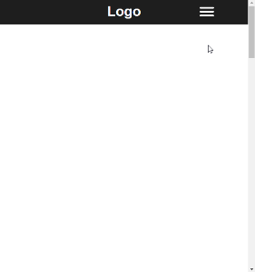

   Como podrás observar, el *nav* ya trae un color por defecto (este color es el *dark*), pero tu se lo puedes cambiar con las diferentes clases para los colores que trae Tyle, o en tu propio css puedes hacerlo. Sin embargo, hay un problema al querer cambiar ciertas propiedades, este porbleba es la especificidad. Para no tener este problema, si no te deja cambiar ciertas propiedades, tienes que hacerlo en tus estilos css de la siguiente manera:

   CSS
   ```css
    @media screen and (max-widht: (medida-responsive) ) {
        .nav-responsive-(nombre-de-medida-responsive) .componente-que-deseas-cambiar {
            /* Propiedades que deseas cambiar */
        }
    }
   ``` 

   Una cosa que puedes cambiar a tu gusto el ancho del *nav-lsit-container*, lo puedes hacer cambiando la propiedad *width*.
   En la siguiente imagen lo podrás notar:
   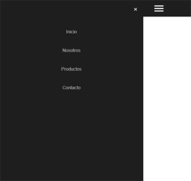   

   También, puedes elegir desde donde viene el *nav*, poniendole la clase ***nav-effect-(lado)*** al *div* con la clase *nav-list-container* ,los lados pueden ser *left* (por defecto),*right*, *top* y *bottom*.

   En la siguiente imagen lo podrás notar:
   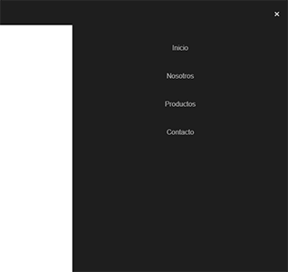  

   Otro componente que puedes agregar al *nav* con Tyle, es una barra de busqueda. Para hacerlo tienes que crear dentro de la etiqueta *nav* un *div* con la clase ***nav-search-container*** y, dentro de este *div* crearás otro más con la clase ***nav-search*** . Dentro de este último, irán 3 elementos: 
   Un *input*, que tendrá que tener la clase ***nab-input*** . Este input tendrá que tener un *id* con cualquier valor.

   Otro elemento será un *div* con la clase ***nav-search-button*** (será el botón para buscar), y dentro de este irá el ícono o bien puede ser una palabra como por ejemplo *"buscar"* . Este ícono o palabra tendrá la clase ***button-search*** . Este elemento tiene que tener el atributo ***data-open-search*** , cuyo valor tiene que ser el mismo que el del *id*.

   El último elemento será una cruz, para cerrar el input en la medida responsive. Para hacerlo, puedes crear un *div* con la clase ***close-input*** , este *div* tendrá que tener el atributo ***data-close-search*** cuyo valor tiene que ser el mismo que el del *id*. Para generar la cruz, pones dentro del *div* el código ***&amp;times;*** 
   
   En el siguiente ejemplo podrás observar lo mencionado anteriormente:
   
   HTML
   ```html
    <nav class="nav nav-responsive-md">
        <div class="nav-logo-container">
            <h1 class="nav-logo">Logo</h1>
        </div>

        <div class="nav-bars-container">
            <div class="nav-bars" data-open-nav="nav">
                <span class="nav-bars-span" data-open-nav="nav"></span>
                <span class="nav-bars-span" data-open-nav="nav"></span>
                <span class="nav-bars-span" data-open-nav="nav"></span>
            </div>
        </div> 

        <div class="nav-list-container w-75 nav-effect-right" id="nav">
            <div class="nav-close" data-close-nav="nav">&times;</div>
            <ul class="nav-list">
                <li class="nav-item"><a href="#" class="nav-link">Inicio</a></li>
                <li class="nav-item"><a href="#" class="nav-link">Nosotros</a></li>
                <li class="nav-item"><a href="#" class="nav-link">Productos</a></li>
                <li class="nav-item"><a href="#" class="nav-link">Contacto</a></li>               
            </ul>
        </div> 

        <div class="nav-search-container mr-3">
            <div class="nav-search">
                <div class="nav-search-button"><p class="button-search" data-open-search="nav-input">Search</p></div>
                <input type="text" class="nav-input" id="nav-input" placeholder="Buscar...">
                <div class="close-input" data-close-search="nav-input">&times;</div>
            </div>
        </div> 
    </nav> 
   ```

   Resultado:
   

   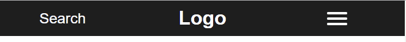


   Además, cuando el *nav* esta en su modo responsive, los diferentes componentes (el logo, las barras, y la barra de busqueda) están en una posición por defecto, que puedes cambiarlas de una manera muy sencilla. Los *divs* a los que les puede agregar la clase para que cambien de posición son el *nav-logo-container*, el *nav-bars-container* y el *nav-search-container*. La clase que le tienes que agregar para cambiarlos de posición es ***nav-component-position-(posición)*** , la posición puede ser *left*, *center*, o *right*. 
   A continuación verán un ejemplo de esto:

   HTML
   ```html
    <nav class="nav nav-responsive-md">
        <div class="nav-logo-container">
            <h1 class="nav-logo">Logo</h1>
        </div>

        <div class="nav-bars-container nav-component-position-left">
            <div class="nav-bars" data-open-nav="nav">
                <span class="nav-bars-span" data-open-nav="nav"></span>
                <span class="nav-bars-span" data-open-nav="nav"></span>
                <span class="nav-bars-span" data-open-nav="nav"></span>
            </div>
        </div> 

        <div class="nav-list-container w-75 nav-effect-right" id="nav">
            <div class="nav-close" data-close-nav="nav">&times;</div>
            <ul class="nav-list">
                <li class="nav-item"><a href="#" class="nav-link">Inicio</a></li>
                <li class="nav-item"><a href="#" class="nav-link">Nosotros</a></li>
                <li class="nav-item"><a href="#" class="nav-link">Productos</a></li>
                <li class="nav-item"><a href="#" class="nav-link">Contacto</a></li>               
            </ul>
        </div> 

        <div class="nav-search-container mr-3 nav-component-position-right">
            <div class="nav-search">
                <div class="nav-search-button"><p class="button-search" data-open-search="nav-input">Search</p></div>
                <input type="text" class="nav-input" id="nav-input" placeholder="Buscar...">
                <div class="close-input" data-close-search="nav-input">&times;</div>
            </div>
        </div> 
    </nav> 
   ```

   Resultado:
   

   Por último, para posicionar un elemento (los elementos son *nav-logo*, *nav-bars* y *nav-search*) en la medida responsive más a la derecha o a la izquierda, tienes que ponerle al elemento la clase ***nav-item-position-(posición)*** . Las posiciones pueden ser *left*, *center* (por defecto) y *right*.
   En la siguiente ejemplo podrás observar esto:

   HTML
   ```html
    <nav class="nav nav-responsive-md">
        <div class="nav-logo-container">
            <h1 class="nav-logo">Logo</h1>
        </div>

        <div class="nav-bars-container nav-component-position-left">
            <div class="nav-bars" data-open-nav="nav">
                <span class="nav-bars-span" data-open-nav="nav"></span>
                <span class="nav-bars-span" data-open-nav="nav"></span>
                <span class="nav-bars-span" data-open-nav="nav"></span>
            </div>
        </div> 

        <div class="nav-list-container w-75 nav-effect-right" id="nav">
            <div class="nav-close" data-close-nav="nav">&times;</div>
            <ul class="nav-list">
                <li class="nav-item"><a href="#" class="nav-link">Inicio</a></li>
                <li class="nav-item"><a href="#" class="nav-link">Nosotros</a></li>
                <li class="nav-item"><a href="#" class="nav-link">Productos</a></li>
                <li class="nav-item"><a href="#" class="nav-link">Contacto</a></li>               
            </ul>
        </div> 

        <div class="nav-search-container mr-3 nav-component-position-right">
            <div class="nav-search">
                <div class="nav-search-button"><p class="button-search" data-open-search="nav-input">Search</p></div>
                <input type="text" class="nav-input" id="nav-input" placeholder="Buscar...">
                <div class="close-input" data-close-search="nav-input">&times;</div>
            </div>
        </div> 
    </nav> 
   ```

   Resultado:
   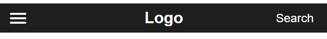
  </details>


